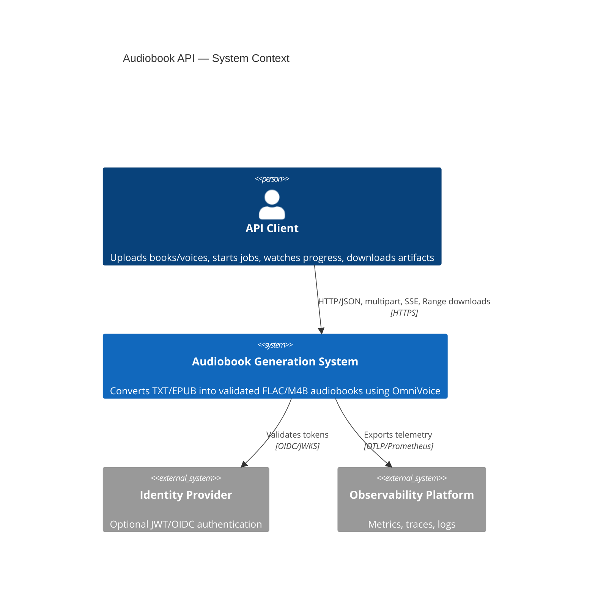
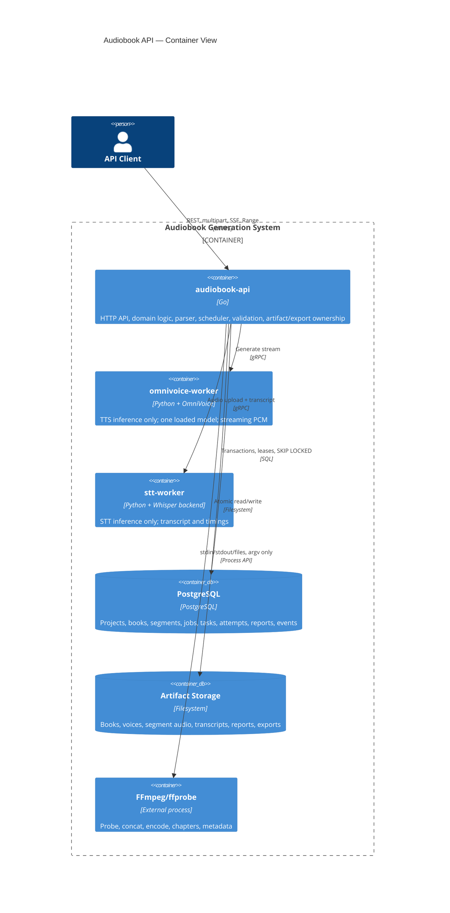
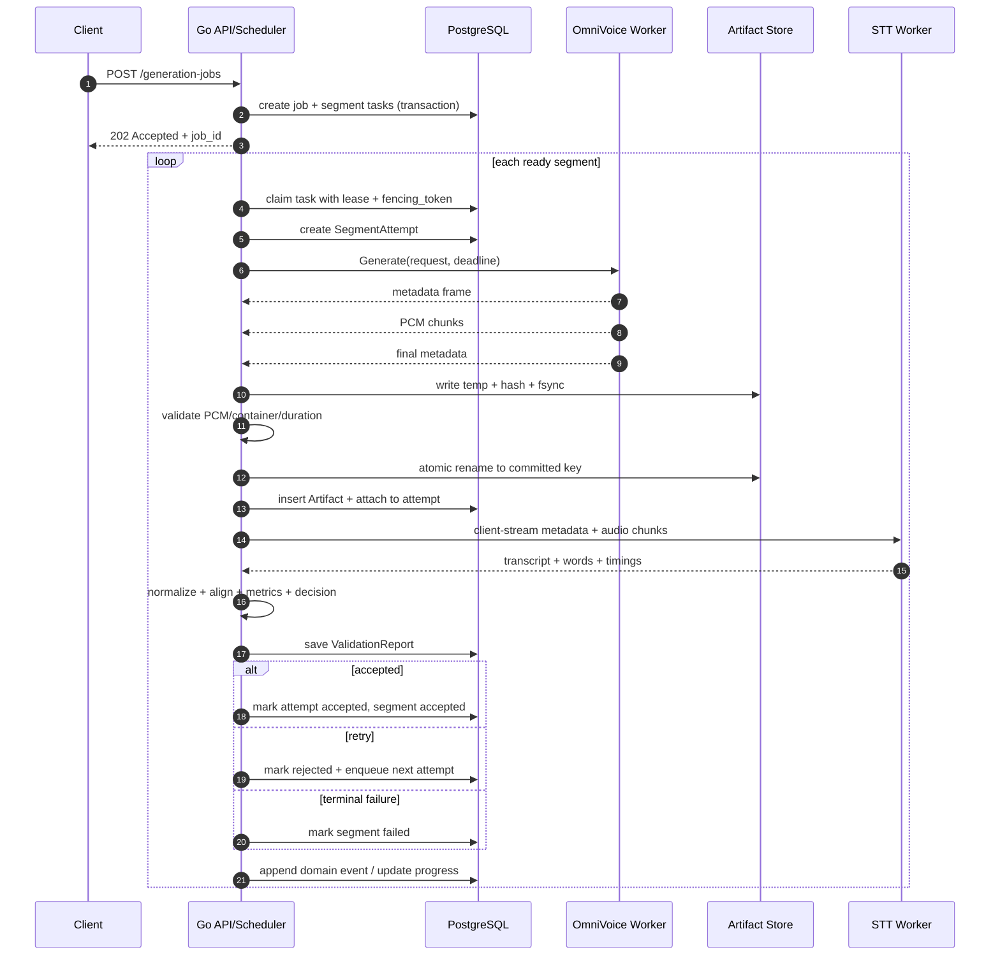
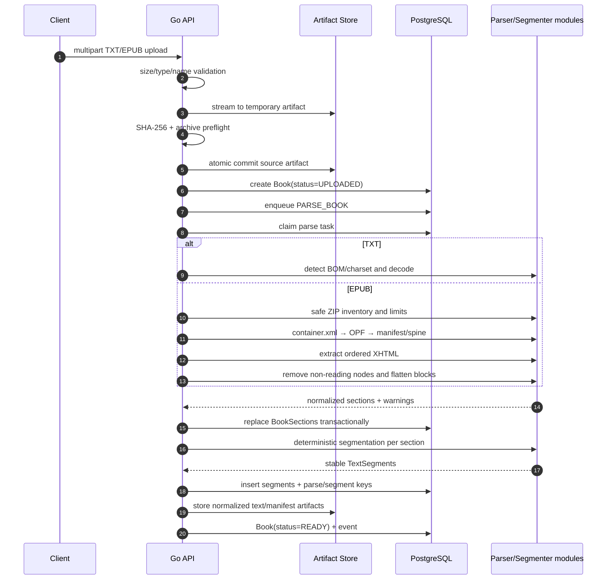
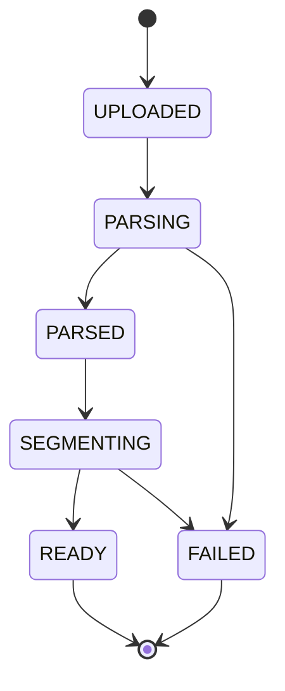
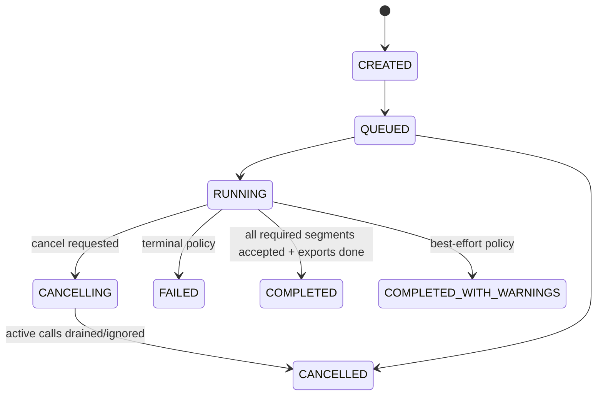
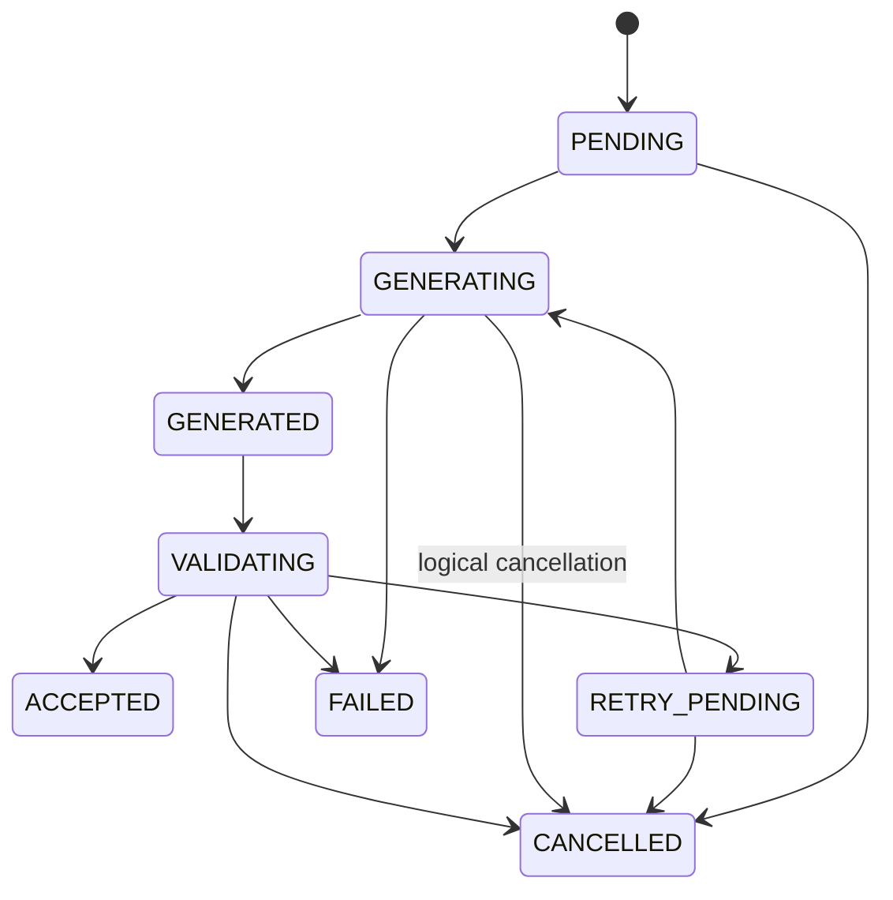
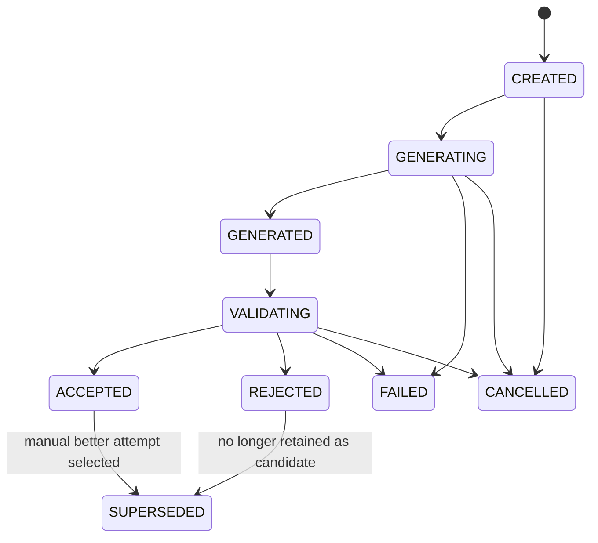

# Технический план API-ориентированной версии `tts-audiobook-tool`

**Репозиторий:** `zeropointnine/tts-audiobook-tool`  
**Зафиксированный commit:** `a82da42894b0cca7509cd518916ccf64c8f04817`  
**Дата анализа:** 30 июля 2026  
**Целевой стек:** Go modular monolith + OmniVoice Python worker + STT Python worker + PostgreSQL + filesystem artifact storage + FFmpeg

---

## Методика и границы анализа

Анализ выполнен по содержимому репозитория на зафиксированном SHA, а не по плавающей ветке `master`. Рассмотрены указанные в задании модули OmniVoice, центральный TTS dispatcher, generation/retry loop, STT, validation, проектная модель, voice utilities, text processing, EPUB import, sound/export pipeline, зависимости, тесты и документация EPUB/ABR.

Локальный clone в рабочей среде не удался из-за недоступности DNS, поэтому исходники прочитаны через GitHub API на конкретном SHA. Номера строк ниже относятся к этому commit и могут сместиться после изменений в репозитории.

Основная граница первой версии: новая система не должна повторять универсальную Python-архитектуру существующего приложения. Она сохраняет только фактическое поведение, необходимое для OmniVoice, STT-проверки, парсинга книг и экспорта.

---

# 1. Executive Summary

Рекомендуемая минимальная архитектура:

```text
Client
  → HTTP/JSON + multipart + SSE
  → audiobook-api (Go modular monolith)
      → PostgreSQL: вся бизнес-модель, задания, leases, attempts, reports
      → filesystem artifact storage: все постоянные файлы
      → gRPC → omnivoice-worker (Python, inference only)
      → gRPC → stt-worker (Python, inference only)
      → FFmpeg subprocess: concat/transcode/chapters/metadata
```

Это не «три равноправных микросервиса». Владельцем системы является Go-приложение. Python workers — внутренние ML-адаптеры без доступа к основной БД и без проектной модели.

Главные выводы анализа:

1. **Существующий Python `Project` нельзя переносить как доменную модель API.** Он является крупным Pydantic-объектом с autosave, filesystem layout, UI-настройками и полями множества TTS-моделей (`project.py`, класс `Project`, примерно строки 34–330). Новая модель должна быть нормализована в PostgreSQL.
2. **`TtsModelType` и `Tts` не являются подходящей основой будущей расширяемости.** Они объединяют registry, auto-detection окружения, UI metadata, model-specific project fields и lazy singletons (`tts_model_type.py`, `tts.py`). Для v1 нужен фиксированный OmniVoice adapter и узкий Go-интерфейс `TTSBackend`, а не plugin framework.
3. **Вся orchestration уже фактически сосредоточена в `GenerateUtil`, но смешана с UI и файлами.** Один цикл выполняет warm-up, generation, post-processing, STT, validation, retry, best-result tracking, сохранение и console output (`generate_util.py`, `GenerateUtil.generate_files`, `generate_and_validate_batch`, `generate`). Эти правила следует переписать в Go как явные state machines и task handlers.
4. **OmniVoice worker можно извлечь малым объёмом кода.** `OmniVoiceModel` загружает модель один раз, поддерживает clone/design/auto и преобразует результат в mono float32 24 kHz. Однако он зависит от `Project`, `ProjectVoiceUtil`, глобального seed и возвращает строки ошибок. Worker должен получить отдельные DTO и structured errors.
5. **STT worker также естественно выделяется.** Существующий `Transcriber` уже является узким адаптером: sanitation/resample → lock → transcription → words. Важный факт: код прямо фиксирует, что Faster Whisper/CTranslate2 instance небезопасен для конкурентного доступа и может падать нативно; поэтому concurrency `1` — правильный default.
6. **Validation и retry должны находиться в Go.** Текущий validator реализует versionable бизнес-правила: normalization, threshold по strictness, DP alignment, homophone/uncommon-word compatibility, truncation и excessive duration. Python STT должен возвращать observations, а решение ACCEPT/RETRY/FAIL принимает Go.
7. **EPUB importer необходимо портировать по characterization fixtures, а не перепроектировать “по памяти”.** Текущий pipeline корректно следует spine, пропускает navigation/publication metadata, чистит XHTML, сохраняет chapter boundaries и имеет нетривиальные whitespace repairs. Это зона высокого риска совместимости.
8. **Export должен управляться Go через FFmpeg.** Текущий concat уже использует безопасный argv-вызов FFmpeg и streaming PCM. Сложные optional DSP-функции следует переносить только после golden tests. FLAC и M4B, chapter metadata и manifest входят в Go ownership.
9. **Message broker в v1 не нужен.** PostgreSQL с `FOR UPDATE SKIP LOCKED`, lease/fencing и idempotent task handlers достаточно для одного или нескольких экземпляров Go API.
10. **Filesystem storage допустим, но должен быть content-addressed и атомарным.** Бизнес-код не должен строить пути из пользовательских имён; `Artifact` хранит opaque storage key, SHA-256, размер, формат и lifecycle state.

Окончательная рекомендация совпадает с ожидаемым базовым вариантом, но уточняет его:

> **Go modular monolith с HTTP API, встроенным scheduler/executor и PostgreSQL leases + один OmniVoice worker + один STT worker + PostgreSQL + content-addressed filesystem artifact storage + FFmpeg.**

---

# 2. SHA анализируемого коммита

```text
a82da42894b0cca7509cd518916ccf64c8f04817
```

Commit message: `add user-defined voice selections functionality`.

Все ссылки на поведение и номера строк в отчёте относятся к этому SHA.

---

# 3. Текущий pipeline

## 3.1 Импорт и сегментация

### TXT

Текстовый input проходит через существующие text utilities, затем:

```text
source text
  → PhraseSegmenter.text_to_phrases
      → pysbd sentence segmentation
      → дополнительное разбиение quotations
      → phrase splits по punctuation
      → split long phrase по max_words
      → ornamental-line / repeated-break corrections
  → PhraseGrouper.text_to_groups
      → grouping по strategy
      → merge short sentences
      → enforce max_words
  → Project.book / PhraseGroup persistence
```

`PhraseGrouper.text_to_groups()` (`text_ops/phrase_grouper.py`, строки 14–55) создаёт один `PhraseGroup` на TTS prompt. `PhraseSegmenter.string_to_sentence_strings()` (`text_ops/phrase_segmenter.py`, строки 68–113) вызывает `pysbd` с `clean=False`, а при неизвестном языке молча переключается на English.

### EPUB

`EpubExtractor.import_epub()` (`text_ops/epub_extractor.py`, примерно строки 364–436):

1. `EbookLib` читает package.
2. `book.spine` обходится в исходном порядке.
3. Navigation и эвристически определённые TOC/publication metadata документы исключаются.
4. XHTML преобразуется в plain text через `BeautifulSoupEpubChapterTextExtractor`.
5. Каждая spine section сегментируется отдельно.
6. Последняя phrase section получает section break.
7. Индекс начала следующей section сохраняется как marker.
8. Оригинальный EPUB и flattened raw text сохраняются в проект.

Текстовый extractor (`epub_extractor.py`, строки 68–352):

- удаляет `script`, `style`, `nav`, `svg`, form/media и другие non-reading tags;
- `<br>` превращает в line break;
- `<hr>` превращает в `* * *` scene break;
- `<li>` получает `- `;
- block elements отделяются blank lines;
- special-case исправляет whitespace-only inline nodes;
- предупреждает о пустом readable body.

## 3.2 Генерация

Текущий путь:

```text
GenerateUtil.generate_files
  → ModelManager.warm_up_models
  → readiness checks
  → in-memory queue [(phrase_index, retry_count)]
  → GenerateUtil.generate_and_validate_batch
      → GenerateUtil.generate
          → prompt creation
          → Tts.generate_using_project
              → active model prepare_text_for_inference
              → OmniVoiceModel.generate_using_project
          → empty/NaN/silence checks
          → trim end silence + peak normalization
          → optional token-noise trim
          → optional internal silence-gap limiting
      → Transcriber.transcribe_to_words
      → Validator.validate
  → retry or save
  → delete redundant attempts
```

`GenerateUtil.generate_files()` (`generate_util.py`, примерно строки 47–387) управляет retry через локальный список. После validation failure элемент возвращается в начало списка. При retry устанавливается random seed. Пять последовательных model errors останавливают run. OOM останавливает run немедленно.

## 3.3 OmniVoice

`OmniVoiceModel.__init__()` (`tts_models/omnivoice_model.py`, строки 31–52):

- CUDA → `cuda:0`, `float16`;
- CPU/MPS → соответствующее device value, `float32`;
- модель загружается через `OmniVoice.from_pretrained()`.

`generate_using_project()` (строки 92–142) выбирает режим:

- reference file существует → VOICE_CLONE;
- instruction непустой → VOICE_DESIGN;
- иначе → AUTO_VOICE.

Clone mode (`_generate_voice_clone`, строки 146–203) создаёт `VoiceClonePrompt`, устанавливает seed, вызывает `model.generate`, берёт первый result, преобразует в float32 mono и возвращает `Sound(..., 24000)`.

## 3.4 STT и validation

`Transcriber.transcribe_to_words()` (`transcriber.py`, строки 28–63):

- заменяет NaN/Inf;
- clip и normalize;
- resample к Whisper sample rate;
- берёт глобальный lock;
- выполняет `transcribe(..., word_timestamps=True)`;
- materializes generator внутри lock;
- flatten segments → words.

`Validator.validate()` (`validator.py`, строки 54–129):

- вычисляет возможную truncation;
- нормализует source/transcript;
- строит word alignment;
- при доступности YAMNet проверяет music;
- проверяет word-error threshold;
- проверяет excessive duration;
- иногда semantic-trims лишний prefix/suffix по word timings.

## 3.5 Сохранение и выбор лучшего результата

Сегменты сохраняются в `{project}/sound_segments/*.flac`; метаданные attempt кодируются в filename. `ProjectSoundSegments.get_best_item_for()` выбирает минимальный error score; `delete_redundants_for()` удаляет прочие файлы. Это filesystem-derived state, приемлемый для desktop app, но неприемлемый для API backend: filename не должен быть базой данных.

## 3.6 Export

`ConcatUtil.make_file()` (`concat_util.py`, примерно строки 161–329):

1. собирает ordered phrase/audio list;
2. streaming-concatenates audio через FFmpeg;
3. optional loudness normalization;
4. optional M4B chapters;
5. строит timed text;
6. добавляет ABR metadata;
7. атомарно оставляет final file, удаляя intermediates.

FFmpeg получает `s16le`, mono, 48 kHz через stdin (`ConcatUtil.init_ffmpeg_stream`, примерно строки 529–558). Команда строится списком аргументов, без shell interpolation.

---

# 4. Компоненты, которые можно переиспользовать

Переиспользование здесь означает «сохранить поведение и fixtures», а не обязательно импортировать Python-модуль в production.

| Источник | Класс/функция | Текущее поведение | Решение |
|---|---|---|---|
| `tts_models/omnivoice_model.py` | `OmniVoiceModel.__init__` | device/dtype selection и `from_pretrained` | Перенести почти буквально в worker bootstrap |
| `tts_models/omnivoice_model.py` | `_generate_voice_clone/design/auto_voice` | фактические OmniVoice API calls и параметры | Переиспользовать ML-вызовы, удалить `Project`, UI, string errors |
| `transcriber.py` | `prepare_sound_for_whisper` | sanitize, normalize, resample | Сохранить в STT worker; покрыть fixtures |
| `stt.py` | `FasterWhisperAdapter`, `MlxWhisperAdapter` | унификация backend outputs | Можно переиспользовать в worker после удаления global app state |
| `stt.py` | inference lock и eager warm-up | защита от native crash и readiness warm-up | Сохранить обязательно; semaphore default 1 |
| `text_ops/epub_extractor.py` | tag rules, spine order, warnings | фактическая EPUB compatibility contract | Портировать в Go по golden fixtures |
| `phrase_segmenter.py`, `phrase_grouper.py` | boundary/reason/merge rules | TTS-oriented segmentation | Портировать поведение в deterministic Go segmenter |
| `text_normalizer.py` | normalization rules | source/transcript comparability | Портировать versioned subset в Go |
| `validator.py` | threshold и DP alignment | word error business policy | Переписать в Go с compatibility tests |
| `sound_pipeline.py` | trim/normalize/pause semantics | audio preparation/export semantics | Сохранить через compatibility tests; переносить поэтапно |
| `concat_util.py` | ordered concat и FFmpeg streaming | проверенная export flow | Реализовать аналог в Go, сохранив fixtures |
| `m4b_chapter_util.py` и ABR docs | chapter/metadata contract | совместимость с player/export | Сохранить как optional compatibility profile |
| существующие tests | EPUB, phrase grouping, retry, validation, M4B, metadata | characterization assets | Преобразовать в cross-language golden fixtures |

---

# 5. Компоненты, которые нужно переписать

| Компонент | Почему нельзя переносить напрямую | Целевая замена |
|---|---|---|
| `Project` | giant mutable object, autosave, filesystem paths, fields всех моделей | нормализованные PostgreSQL entities + config snapshots |
| `TtsModelType` | универсальный hardcoded registry, UI/data/install concerns | fixed `OMNIVOICE` enum + worker capabilities |
| `Tts` | global singleton dispatcher и runtime environment detection | Go `TTSBackend` client + Python worker bootstrap |
| `GenerateUtil.generate_files` | orchestration смешана с console UI, memory queue и direct files | persistent Go workflow + task table + state machines |
| retry queue | теряется при crash, нет lease/fencing | PostgreSQL tasks и SegmentAttempt records |
| string errors | неустойчивы для policy | gRPC status + typed `WorkerError` |
| filename metadata | filesystem является source of truth | `Artifact`, `SegmentAttempt`, `ValidationReport` в БД |
| Python validation decision | ML service получает бизнес-власть | Go validator; Python только transcript/timings |
| Python path selection | worker знает project dir | Go streaming input/output и artifact ownership |
| UI interrupts | process-global state | `context.Context`, cancellation flag, gRPC cancel |
| model auto-discovery | окружение выбирает активную модель | server configuration фиксирует worker endpoint/model |
| project snapshot с абсолютным `dir_path` | privacy/security и непереносимость | sanitized export manifest без host paths |

---

# 6. Целевая архитектура

## 6.1 Architectural style

`audiobook-api` — **modular monolith**, а не thin API gateway. Внутри одного deployable binary находятся:

- HTTP transport;
- application services;
- project/book/voice/generation/validation/export domains;
- PostgreSQL repositories;
- artifact store;
- scheduler и task executors;
- gRPC clients;
- FFmpeg runner;
- SSE event stream.

Разделение внутри Go выполняется пакетами и явными interfaces, а не network boundaries.

## 6.2 Deployable components

### `audiobook-api` — Go

Единственный владелец бизнес-состояния, файлов и orchestration.

### `omnivoice-worker` — Python

Один загруженный OmniVoice model instance. Принимает self-contained inference request, возвращает metadata + PCM stream. Не знает project/book/job lifecycle.

### `stt-worker` — Python

Один загруженный Whisper-compatible instance. Принимает audio stream + expected text metadata, возвращает transcript/words/segments/confidence. Не решает, приемлемо ли аудио.

## 6.3 Supporting infrastructure

- PostgreSQL — source of truth и queue.
- Filesystem — initial artifact backend.
- FFmpeg/ffprobe — trusted external executables, path configured by operator.
- OpenTelemetry collector и Prometheus — optional deployment dependencies, не бизнес-зависимости.

## 6.4 Важное уточнение к «одному Go сервису»

Для v1 не требуется отдельный scheduler process. Тот же binary запускает HTTP server и N task-executor goroutines. В будущем role можно переключить config (`API_ONLY`, `WORKER_ONLY`, `ALL`) без изменения domain model. Это позволяет масштабировать API и orchestration раздельно, не создавая новый продуктовый сервис сейчас.

---

# 7. C4 Context Mermaid diagram



---

# 8. C4 Container Mermaid diagram



---

# 9. Generation sequence Mermaid diagram



---

# 10. Retry sequence Mermaid diagram

```mermaid
sequenceDiagram
  autonumber
  participant G as Go Orchestrator
  participant DB as PostgreSQL
  participant O as OmniVoice Worker
  participant S as STT Worker

  G->>DB: claim GENERATE_SEGMENT task
  G->>O: Generate(attempt=1, seed=A)
  O-->>G: audio
  G->>S: Transcribe(audio)
  S-->>G: transcript
  G->>G: validation => REJECT(WER/quality)
  G->>DB: persist attempt 1 and report
  G->>DB: enqueue attempt 2, seed=B

  G->>O: Generate(attempt=2, seed=B)
  O-->>G: OUT_OF_MEMORY retryable=true
  G->>DB: persist typed error
  G->>G: apply OOM policy/cooldown
  G->>DB: enqueue attempt 3 if budget remains

  G->>O: Generate(attempt=3, seed=C)
  O-->>G: audio
  G->>S: Transcribe(audio)
  S-->>G: transcript
  G->>G: compare with previous attempts
  alt passes threshold
    G->>DB: ACCEPT attempt 3; supersede 1/2
  else budget exhausted and best-effort enabled
    G->>DB: ACCEPT_WITH_WARNING best scored attempt
  else budget exhausted
    G->>DB: FAIL segment; retain attempts
  end
```

---

# 11. Book parsing sequence Mermaid diagram



# 12. Ответственность Go-сервиса

Go отвечает за всё, что должно быть детерминированным, транзакционным, восстанавливаемым и наблюдаемым как бизнес-процесс.

## 12.1 HTTP и application layer

- authentication/authorization;
- request size/rate limits;
- projects/books/voices/jobs/exports APIs;
- multipart upload/download;
- idempotency keys внешних команд;
- pagination и filtering;
- RFC 7807-like problem responses;
- SSE progress stream.

## 12.2 Book domain

- source artifact ownership;
- TXT encoding detection;
- EPUB package parsing;
- XHTML flattening;
- chapter/section model;
- parser warnings;
- parse version/config snapshots;
- normalized text artifact.

## 12.3 Segmentation domain

- versioned text normalization;
- deterministic sentence/phrase/segment rules;
- max words и max characters;
- paragraph/scene/chapter boundaries;
- stable IDs;
- original and normalized text;
- warnings для over-limit atomic phrases.

Важное правило из предыдущей задачи проекта: если одна неделимая phrase превышает лимит, система не должна терять её или зацикливаться. Она сохраняет phrase целиком, ставит warning `SEGMENT_LIMIT_EXCEEDED_BY_ATOMIC_PHRASE`, а downstream generation получает её как один сегмент. Это делает pipeline total и детерминированным.

## 12.4 Generation/orchestration

- task creation and leases;
- worker capability checks;
- attempt numbering и seed policy;
- deadlines/cancellation;
- audio stream receive;
- technical validation;
- artifact commit;
- STT invocation;
- business validation;
- retry/best-attempt decision;
- progress/events;
- crash recovery.

## 12.5 Artifact ownership

- temporary file creation;
- content hashing while streaming;
- size and format limits;
- fsync/atomic rename;
- DB metadata;
- orphan cleanup;
- download authorization;
- ETag/Range/Content-Disposition.

## 12.6 Export

- ordered accepted attempt selection;
- missing-segment preflight;
- pause/section policy;
- FFmpeg execution;
- FLAC/M4B encoding;
- standard chapters;
- export manifest;
- optional ABR compatibility metadata;
- export artifact lifecycle.

---

# 13. Ответственность OmniVoice worker

## 13.1 Что worker делает

- загружает одну configured OmniVoice model при startup;
- определяет configured/available device;
- прогревает минимальный inference path;
- публикует readiness только после успешной загрузки;
- поддерживает `VOICE_CLONE`, `VOICE_DESIGN`, `AUTO_VOICE`;
- создаёт и кэширует `VoiceClonePrompt`;
- устанавливает request seed;
- выполняет synchronous `model.generate`;
- преобразует output в mono PCM S16LE 24 kHz;
- streams metadata/audio/final status;
- классифицирует technical errors;
- ограничивает active inference semaphore;
- очищает temporary tensors/cache после OOM, насколько позволяет библиотека.

## 13.2 Что worker не делает

- не читает PostgreSQL;
- не выбирает project/segment/voice из business state;
- не строит persistent paths;
- не сохраняет final artifact;
- не определяет retry;
- не обновляет job status;
- не вызывает STT;
- не сравнивает transcript;
- не выполняет concat/export;
- не предоставляет публичный API.

## 13.3 DTO вместо `Project`

```text
GenerateRequest
  request_id
  api_version
  job_id
  segment_id
  attempt_id
  attempt_number
  text
  mode
  voice_reference stream or reference payload
  voice_reference_text
  instruction
  speed
  guidance_scale
  num_steps
  seed
  language
  output_format
  deadline_hint_ms
```

`job_id` и `segment_id` используются только для correlation/logging, не для query к БД.

## 13.4 Voice clone cache

Текущий код хранит только один prompt и сравнивает tuple `(voice_path, ref_text)`. Это не подходит серверу: path не идентифицирует content, отсутствуют model version, capacity и защита от stampede.

Рекомендуемый key:

```text
SHA256(
  "omnivoice-clone-cache-v1" || 0x00 ||
  model_id || 0x00 ||
  model_version || 0x00 ||
  sha256(reference_audio_bytes) || 0x00 ||
  normalized_reference_text
)
```

Cache design:

- process-local weighted LRU;
- configurable `max_entries` и приблизительный `max_bytes`;
- per-key single-flight (`asyncio.Lock`/future map), чтобы один prompt не создавался параллельно;
- metrics hit/miss/eviction/build_seconds/build_errors;
- explicit full invalidation при model reload/version change;
- entries immutable после publication;
- no persistent pickle cache в v1: модельные objects могут быть version/device-dependent;
- optional short negative-cache только для deterministic invalid reference errors, без user text в metrics.

## 13.5 Concurrency

Default `max_concurrency=1`. Даже если Python gRPC server принимает несколько RPC, inference semaphore должен охватывать:

- seed setup;
- clone prompt creation, если library shares mutable model state;
- `model.generate`;
- output materialization.

Voice prompt cache lookup может выполняться вне semaphore, но prompt construction безопаснее сначала включить в общий critical section. Оптимизация возможна только после stress tests.

---

# 14. Ответственность STT worker

## 14.1 ML logic

- model load/warm-up;
- audio input validation на transport level;
- PCM decode;
- NaN/Inf sanitation, если input float format когда-либо будет добавлен;
- normalize/clip;
- resample к backend rate;
- transcription;
- word timestamps;
- segment timestamps;
- confidence/probability;
- detected language/probability, если backend предоставляет;
- technical errors и telemetry.

## 14.2 Где сравнивать текст

Рекомендуется **Вариант A+**:

Python возвращает raw transcript, normalized transcript как диагностическое convenience field, words/segments/confidence. Go заново выполняет canonical normalization и все decision metrics.

Причина:

- normalized transcript от worker полезен для debugging/version comparison;
- только Go владеет `validation_version` и policy;
- изменение tolerance не требует новой STT inference;
- один transcript можно повторно оценить разными policy;
- migration позволяет сначала сравнивать Python и Go normalization в shadow mode.

`normalized_transcript` от Python не является authoritative для ACCEPT/RETRY.

## 14.3 Concurrency

Существующий `Stt.inference_lock` документирует native crash при concurrent access к одному Faster Whisper/CTranslate2 instance. Поэтому:

- default max concurrency = 1;
- lock должен включать сам `transcribe()` и полную materialization generator;
- parallelism достигается несколькими worker replicas/instances, а не threads одного model object;
- readiness false во время initial model load;
- after fatal native/backend error process лучше завершить и дать supervisor перезапустить его, чем продолжать в неопределённом состоянии.

---

# 15. REST API

## 15.1 Общие conventions

- prefix `/v1`;
- UUIDv7/ULID identifiers;
- timestamps RFC 3339 UTC;
- `Idempotency-Key` для create/start/retry/export commands;
- optimistic concurrency через `ETag`/`If-Match` для mutable resources, где нужно;
- problem response:

```json
{
  "type": "https://errors.example/v1/book-invalid",
  "title": "Book upload is invalid",
  "status": 422,
  "code": "EPUB_ZIP_BOMB_LIMIT",
  "detail": "Expanded EPUB size exceeds configured limit",
  "request_id": "...",
  "errors": []
}
```

## 15.2 Projects

### `POST /v1/projects`

```json
{
  "name": "My Book",
  "language": "en"
}
```

Returns `201 Created`.

### `GET /v1/projects/{projectId}`

Returns project summary, current book/voice defaults and active jobs.

## 15.3 Books

### `POST /v1/projects/{projectId}/books`

`multipart/form-data`:

- `file`: TXT/EPUB;
- `settings`: JSON part with parser/segmentation settings.

Returns `202 Accepted` because parse can be asynchronous.

### `GET /v1/books/{bookId}`

Includes status, title, source type, content hash, versions, warnings summary.

### `GET /v1/books/{bookId}/sections`

Pagination by section ordinal.

### `GET /v1/books/{bookId}/segments`

Filters: `section_id`, `status`, `after`, `limit`; optionally `include_text=false` to avoid large responses.

### Recommended additional endpoint

`POST /v1/books/{bookId}/reparse` with explicit parser/segmentation settings and idempotency. It creates a new `BookRevision` or replaces only when no active job references current revision. Prefer immutable revisions.

## 15.4 Voices

### `POST /v1/projects/{projectId}/voices`

`multipart/form-data` for clone mode; JSON request for design/auto.

Clone fields:

- `reference_audio`;
- `reference_text`;
- `settings` JSON.

Design/auto fields:

```json
{
  "mode": "VOICE_DESIGN",
  "instruction": "Calm, warm narrator",
  "speed": 1.0,
  "guidance_scale": 2.0,
  "num_steps": 32,
  "default_seed": 12345
}
```

### `GET /v1/voices/{voiceId}`

No filesystem path. Returns artifact metadata and settings.

## 15.5 Generation jobs

### `POST /v1/projects/{projectId}/generation-jobs`

```json
{
  "book_id": "...",
  "voice_id": "...",
  "validation_profile": {
    "strictness": "MODERATE",
    "max_generation_attempts": 3,
    "allow_best_effort": false
  },
  "segment_range": null
}
```

The server snapshots all mutable settings/model versions into the job.

### `GET /v1/generation-jobs/{jobId}`

```json
{
  "id": "...",
  "status": "RUNNING",
  "phase": "VALIDATING",
  "progress": {
    "total_segments": 100,
    "pending_segments": 40,
    "generating_segments": 1,
    "validating_segments": 0,
    "accepted_segments": 55,
    "retrying_segments": 3,
    "failed_segments": 1,
    "cancelled_segments": 0,
    "export_status": "NOT_REQUESTED"
  },
  "warnings": []
}
```

### `POST /v1/generation-jobs/{jobId}/cancel`

Idempotent command. Returns `202` with current desired state.

### `GET /v1/generation-jobs/{jobId}/segments`

Returns segment execution status and best/current attempt.

### `GET /v1/generation-jobs/{jobId}/segments/{segmentId}`

Includes attempts, validation reports and typed errors.

### `POST /v1/generation-jobs/{jobId}/segments/{segmentId}/retry`

Manual retry creates a new attempt; it never mutates an old attempt.

```json
{
  "seed": null,
  "reason": "manual_review",
  "force": false
}
```

## 15.6 Artifacts

### `GET /v1/artifacts/{artifactId}`

Metadata only.

### `GET /v1/artifacts/{artifactId}/content`

Requirements:

- `Content-Type`;
- `Content-Length`;
- `Accept-Ranges: bytes`;
- `ETag: "sha256-..."`;
- `Last-Modified`;
- RFC-compliant `Content-Disposition` with sanitized filename;
- conditional GET and Range support.

Do not return server storage keys.

## 15.7 Exports

### `POST /v1/generation-jobs/{jobId}/exports`

```json
{
  "format": "M4B",
  "sample_rate": 48000,
  "aac_bitrate": "128k",
  "include_chapters": true,
  "include_abr_metadata": false,
  "pause_profile": "DEFAULT_V1"
}
```

Returns `202` + export ID.

### `GET /v1/exports/{exportId}`

Includes status, error, manifest artifact and final artifact.

## 15.8 Events

### `GET /v1/generation-jobs/{jobId}/events`

SSE:

```text
id: 98123
event: segment.accepted
data: {"job_id":"...","segment_id":"...","attempt":2,"accepted":56}
```

- support `Last-Event-ID`;
- events persisted in DB/outbox table;
- heartbeat comments every 15–30 seconds;
- client reconnect is safe;
- SSE is notification, REST resource remains source of truth.

---

# 16. gRPC protobuf contracts

## 16.1 Contract decisions

### OmniVoice

Use one production method:

```proto
rpc Generate(GenerateRequest) returns (stream GenerateResponse);
```

Separate `GenerateStream` is redundant. A unary method would require buffering the whole audio response and creates two semantics. `Generate` is server-streaming even if OmniVoice internally produces the result only after synchronous inference.

### STT

Use client-streaming request, unary response:

```proto
rpc Transcribe(stream TranscribeRequest) returns (TranscribeResponse);
```

Metadata is the first frame; audio chunks follow. Bidi streaming adds no value because STT response is needed only after complete audio.

### Health

Use standard `grpc.health.v1.Health` in addition to domain `GetCapabilities`. A custom `Health` method is unnecessary unless detailed model diagnostics are required; those can be exposed by `GetCapabilities`/admin endpoint.

## 16.2 Proposed `.proto`

```proto
syntax = "proto3";

package audiobook.ml.v1;

option go_package = "example.com/audiobook/api/proto/ml/v1;mlv1";

import "google/protobuf/duration.proto";
import "google/protobuf/empty.proto";
import "google/protobuf/struct.proto";
import "google/protobuf/timestamp.proto";

message TraceContext {
  string traceparent = 1;
  string tracestate = 2;
}

message WorkerError {
  string code = 1;
  string message = 2;
  bool retryable = 3;
  map<string, string> details = 4;
}

message WorkerCapabilities {
  string api_version = 1;
  string worker_id = 2;
  string service_type = 3;
  string model_id = 4;
  string model_version = 5;
  string device_type = 6;
  string device_name = 7;
  uint64 total_vram_bytes = 8;
  uint64 available_vram_bytes = 9;
  uint32 max_concurrency = 10;
  repeated uint32 supported_sample_rates = 11;
  repeated string supported_languages = 12;
  repeated string supported_modes = 13;
  bool ready = 14;
  repeated string warnings = 15;
}

service OmniVoiceService {
  rpc GetCapabilities(google.protobuf.Empty) returns (WorkerCapabilities);
  rpc Generate(GenerateRequest) returns (stream GenerateResponse);
}

enum VoiceMode {
  VOICE_MODE_UNSPECIFIED = 0;
  VOICE_CLONE = 1;
  VOICE_DESIGN = 2;
  AUTO_VOICE = 3;
}

enum AudioEncoding {
  AUDIO_ENCODING_UNSPECIFIED = 0;
  PCM_S16LE = 1;
  WAV_PCM_S16LE = 2;
}

message AudioSpec {
  AudioEncoding encoding = 1;
  uint32 sample_rate_hz = 2;
  uint32 channels = 3;
  uint32 bits_per_sample = 4;
}

message VoiceReference {
  bytes audio = 1; // bounded reference only; see alternative streaming note
  string sha256 = 2;
  string normalized_reference_text = 3;
  string content_type = 4;
}

message GenerateRequest {
  string api_version = 1;
  string request_id = 2;
  string job_id = 3;
  string segment_id = 4;
  string attempt_id = 5;
  uint32 attempt_number = 6;
  TraceContext trace = 7;

  string text = 10;
  string language = 11;
  VoiceMode mode = 12;
  VoiceReference voice_reference = 13;
  string instruction = 14;
  float speed = 15;
  float guidance_scale = 16;
  uint32 num_steps = 17;
  uint64 seed = 18;
  AudioSpec requested_audio = 19;
  google.protobuf.Duration deadline_hint = 20;
}

message GenerateMetadata {
  string request_id = 1;
  string segment_id = 2;
  string attempt_id = 3;
  uint32 attempt_number = 4;
  AudioSpec audio = 5;
  uint64 seed_used = 6;
  string model_id = 7;
  string model_version = 8;
  string device = 9;
  bool voice_cache_hit = 10;
}

message AudioChunk {
  uint64 sequence = 1;
  bytes data = 2;
  fixed32 crc32c = 3;
}

message GenerateCompleted {
  uint64 total_bytes = 1;
  uint64 total_samples = 2;
  uint64 duration_ms = 3;
  string audio_sha256 = 4;
  uint64 generation_duration_ms = 5;
  uint64 first_audio_ms = 6;
  repeated string warnings = 7;
}

message GenerateResponse {
  oneof frame {
    GenerateMetadata metadata = 1;
    AudioChunk audio_chunk = 2;
    GenerateCompleted completed = 3;
    WorkerError error = 4;
  }
}

service STTService {
  rpc GetCapabilities(google.protobuf.Empty) returns (WorkerCapabilities);
  rpc Transcribe(stream TranscribeRequest) returns (TranscribeResponse);
}

message TranscribeMetadata {
  string api_version = 1;
  string request_id = 2;
  string job_id = 3;
  string segment_id = 4;
  string attempt_id = 5;
  uint32 attempt_number = 6;
  TraceContext trace = 7;

  string expected_text = 10;
  string language = 11;
  AudioSpec audio = 12;
  bool word_timestamps_required = 13;
  google.protobuf.Duration deadline_hint = 14;
}

message TranscribeRequest {
  oneof frame {
    TranscribeMetadata metadata = 1;
    AudioChunk audio_chunk = 2;
  }
}

message Word {
  string text = 1;
  string normalized_text = 2;
  uint64 start_ms = 3;
  uint64 end_ms = 4;
  float probability = 5;
}

message TranscriptSegment {
  string text = 1;
  uint64 start_ms = 2;
  uint64 end_ms = 3;
  repeated Word words = 4;
  float confidence = 5;
}

message TranscribeResponse {
  string request_id = 1;
  string segment_id = 2;
  string attempt_id = 3;
  uint32 attempt_number = 4;
  string transcript = 5;
  string normalized_transcript = 6;
  string detected_language = 7;
  float language_probability = 8;
  uint64 duration_ms = 9;
  repeated Word words = 10;
  repeated TranscriptSegment segments = 11;
  float confidence = 12;
  uint64 processing_duration_ms = 13;
  repeated string warnings = 14;
  WorkerError error = 15;
}
```

## 16.3 Voice reference transport caveat

В примере `VoiceReference.audio` unary bytes допустимы только потому, что voice reference ограничен, например, 15 секунд и несколькими MiB. Для строго streaming-only дизайна лучше добавить отдельный client-streaming `PrepareVoice` и возвращать request-scoped opaque cache token. Однако это создаёт lifecycle/state API в worker.

Для MVP рекомендуем:

- Go нормализует/ограничивает reference artifact;
- `GenerateRequest` передаёт bounded bytes;
- gRPC max receive size настроен явно;
- cache key проверяется по SHA-256;
- worker не принимает filesystem path/URL.

Это проще и безопаснее, чем persistent worker-side voice handles.

## 16.4 Error mapping

OmniVoice codes:

```text
INVALID_REQUEST
MODEL_NOT_READY
VOICE_REFERENCE_ERROR
OUT_OF_MEMORY
INFERENCE_ERROR
TIMEOUT
CANCELLED
INTERNAL_ERROR
```

STT codes:

```text
INVALID_AUDIO
MODEL_NOT_READY
OUT_OF_MEMORY
TRANSCRIPTION_ERROR
TIMEOUT
CANCELLED
INTERNAL_ERROR
```

Transport-level failures используют canonical gRPC status, а `WorkerError` несёт stable application code. Например:

- bad request → `InvalidArgument` + `INVALID_REQUEST`;
- not loaded → `Unavailable` + `MODEL_NOT_READY`;
- timeout → `DeadlineExceeded` + `TIMEOUT`;
- cancellation → `Cancelled` + `CANCELLED`;
- OOM → обычно `ResourceExhausted` + `OUT_OF_MEMORY`.

# 17. Data model

Предложенная исходная модель правильна по направлению, но недостаточна для immutable attempts, queue recovery, parser revisions и export lifecycle.

## 17.1 Project

```text
Project
  id UUIDv7 PK
  name text
  status enum
  default_language text
  created_at timestamptz
  updated_at timestamptz
  row_version bigint
  deleted_at timestamptz null
```

`Project.status` должен быть coarse-grained: `ACTIVE`, `ARCHIVED`, `DELETED`. Не следует дублировать в нём detailed generation phase; эта фаза принадлежит job.

## 17.2 Book и revision

Рекомендуется отделить логическую книгу от immutable parse revision.

```text
Book
  id
  project_id
  title
  original_filename
  source_type TXT|EPUB
  source_artifact_id
  content_hash
  created_at

BookRevision
  id
  book_id
  status UPLOADED|PARSING|SEGMENTING|READY|FAILED
  parser_version
  parser_settings jsonb
  parse_idempotency_key
  segmentation_version
  segmentation_settings jsonb
  normalized_text_artifact_id null
  manifest_artifact_id null
  warning_count
  error_code null
  error_message null
  created_at
  completed_at null
```

Почему revision полезен:

- active GenerationJob всегда ссылается на immutable text layout;
- reparse не ломает IDs существующего job;
- можно сравнить parser versions;
- rollback к старой segmentation не требует destructive update.

Для минимального MVP `BookRevision` можно назвать просто `Book`, но его записи должны оставаться immutable после READY. Отдельная таблица — предпочтительный вариант.

## 17.3 BookSection

```text
BookSection
  id
  book_revision_id
  ordinal int
  stable_key text
  title text
  source_href text null
  source_media_type text null
  source_text text
  normalized_text text
  content_hash text
  boundary_kind enum
  warnings jsonb
  created_at

UNIQUE(book_revision_id, ordinal)
UNIQUE(book_revision_id, stable_key)
```

`stable_key`:

```text
sha256("section-v1" + book_content_hash + normalized_source_href + ordinal + section_content_hash)
```

Href не должен быть единственным identity: разные EPUB могут повторять names, а TXT не имеет href.

## 17.4 TextSegment

```text
TextSegment
  id
  book_revision_id
  section_id
  ordinal_global
  ordinal_in_section
  stable_key
  source_text
  normalized_text
  content_hash
  word_count
  char_count
  terminal_boundary WORD|PHRASE|SENTENCE|PARAGRAPH|SCENE|SECTION
  over_limit_warning bool
  segmentation_version
  created_at

UNIQUE(book_revision_id, ordinal_global)
UNIQUE(book_revision_id, stable_key)
```

Stable key должен зависеть от revisioned algorithm/config и content, но не от случайного DB UUID:

```text
sha256(
  "segment-v1" || section.stable_key || ordinal_in_section ||
  normalized_text || terminal_boundary || segmentation_settings_hash
)
```

## 17.5 VoiceProfile

```text
VoiceProfile
  id
  project_id
  name
  engine_kind OMNIVOICE
  mode VOICE_CLONE|VOICE_DESIGN|AUTO_VOICE
  reference_artifact_id null
  reference_text null
  normalized_reference_text null
  instruction null
  speed
  guidance_scale
  num_steps
  default_seed null
  language null
  settings_hash
  status ACTIVE|INVALID|ARCHIVED
  created_at
  updated_at
```

Client не задаёт `model_path` или `model_id`; model identity приходит из server config/capabilities и snapshot в job.

## 17.6 GenerationJob

```text
GenerationJob
  id
  project_id
  book_revision_id
  voice_profile_id
  status CREATED|QUEUED|RUNNING|CANCELLING|CANCELLED|FAILED|COMPLETED|COMPLETED_WITH_WARNINGS
  phase PARSING|SEGMENTING|GENERATING|VALIDATING|RETRYING|SEGMENTS_READY|EXPORTING|COMPLETED
  config_snapshot jsonb
  validation_profile_snapshot jsonb
  omnivoice_model_id
  omnivoice_model_version
  stt_model_id
  stt_model_version
  cancellation_requested_at null
  idempotency_key
  created_at
  started_at null
  completed_at null
  error_code null
  error_message null
  row_version
```

Progress counters можно кэшировать в job для быстрых reads, но source of truth — segment executions. Updates должны выполняться транзакционно или периодически reconcile.

## 17.7 JobSegment

Нужна отдельная execution record между job и immutable text segment:

```text
JobSegment
  id
  job_id
  segment_id
  ordinal
  status PENDING|GENERATING|GENERATED|VALIDATING|RETRY_PENDING|ACCEPTED|FAILED|CANCELLED
  best_attempt_id null
  current_attempt_number
  next_attempt_at null
  terminal_reason null
  created_at
  updated_at

UNIQUE(job_id, segment_id)
UNIQUE(job_id, ordinal)
```

## 17.8 SegmentAttempt

```text
SegmentAttempt
  id
  job_segment_id
  attempt_number
  status CREATED|GENERATING|GENERATED|VALIDATING|ACCEPTED|REJECTED|FAILED|CANCELLED|SUPERSEDED
  request_id
  seed
  generation_idempotency_key
  validation_idempotency_key null
  worker_id null
  model_id
  model_version
  audio_artifact_id null
  transcript_artifact_id null
  validation_report_id null
  quality_score jsonb null
  error_code null
  error_message null
  error_retryable null
  started_at null
  generated_at null
  completed_at null

UNIQUE(job_segment_id, attempt_number)
UNIQUE(generation_idempotency_key)
```

Старые attempts никогда не переписываются в «новый результат». Их status меняется, но seed/audio/report остаются immutable.

## 17.9 ValidationReport

```text
ValidationReport
  id
  job_id
  segment_id
  attempt_id
  validation_version
  expected_text
  transcript
  normalized_expected
  normalized_transcript
  expected_word_count
  transcript_word_count
  substitutions_count
  deletions_count
  insertions_count
  effective_error_count
  word_error_rate
  threshold_count
  strictness
  missing_words jsonb
  extra_words jsonb
  substituted_words jsonb
  alignment jsonb
  possible_truncation bool
  invalid_reasons text[]
  audio_duration_ms
  duration_ratio null
  transcript_confidence null
  language_detected null
  decision ACCEPT|RETRY|FAIL|ACCEPT_WITH_WARNING
  decision_reason
  quality_score jsonb
  created_at

UNIQUE(attempt_id, validation_version)
```

## 17.10 Artifact

```text
Artifact
  id
  state TEMPORARY|COMMITTED|QUARANTINED|DELETED
  type BOOK_SOURCE|NORMALIZED_TEXT|VOICE_REFERENCE|SEGMENT_AUDIO|TRANSCRIPT|VALIDATION_REPORT|EXPORT|MANIFEST|DEBUG
  storage_backend FILESYSTEM
  storage_key
  original_filename null
  safe_download_filename
  content_type
  format null
  size_bytes
  sha256
  etag
  duration_ms null
  sample_rate null
  channels null
  bits_per_sample null
  created_at
  committed_at null
  deleted_at null

UNIQUE(storage_backend, storage_key)
```

Relations к owner лучше хранить обычными FK из domain tables или `ArtifactLink`, а не polymorphic owner columns без integrity.

## 17.11 Task queue

```text
Task
  id
  task_type PARSE_BOOK|SEGMENT_BOOK|GENERATE_SEGMENT|TRANSCRIBE_ATTEMPT|VALIDATE_ATTEMPT|FINALIZE_JOB|EXPORT_JOB|CLEANUP_ARTIFACTS
  aggregate_type
  aggregate_id
  status READY|LEASED|SUCCEEDED|FAILED|CANCELLED
  priority
  available_at
  lease_owner null
  lease_token bigint
  lease_until null
  heartbeat_at null
  execution_count
  max_executions
  idempotency_key
  payload jsonb
  last_error_code null
  last_error_message null
  created_at
  updated_at

UNIQUE(idempotency_key)
INDEX(status, available_at, priority)
```

`lease_token` является fencing token: completion update принимается только от holder текущего token.

## 17.12 ExportJob и events

```text
ExportJob
  id
  generation_job_id
  status
  settings_snapshot jsonb
  idempotency_key
  output_artifact_id null
  manifest_artifact_id null
  created_at
  started_at null
  completed_at null
  error_code null
  error_message null

DomainEvent
  id bigint generated always as identity
  aggregate_type
  aggregate_id
  event_type
  payload jsonb
  created_at
```

`DomainEvent.id` служит SSE cursor.

---

# 18. State machines

## 18.1 BookRevision



Parsing и segmentation можно реализовать одним task handler, но отдельные statuses полезны для progress и diagnostics.

## 18.2 GenerationJob



`phase` — отдельное поле; не надо создавать cross-product enum из status×phase.

## 18.3 JobSegment



## 18.4 SegmentAttempt



Logical `CANCELLED` может быть установлен до фактического окончания synchronous ML call; late result must be ignored using state and fencing checks.

---

# 19. Storage design

## 19.1 Filesystem layout

Не использовать user-controlled names как directories/keys.

```text
{artifact_root}/
  tmp/
    {process_id}/{uuid}.partial
  objects/
    sha256/{aa}/{bb}/{full_sha256}
  exports/
    {export_id}/{safe_filename}
  quarantine/
```

Content-addressed objects позволяют deduplication и integrity checks. Export filename может быть отдельным human-readable link/copy, но canonical object хранится по hash.

## 19.2 Commit protocol

1. Go создаёт temp file с `O_EXCL`, mode `0600`.
2. Streams bytes и одновременно считает SHA-256/size.
3. Проверяет expected bytes/frame alignment/limits.
4. `fsync(file)`.
5. Закрывает file.
6. Создаёт destination directories с fixed permissions.
7. Atomic rename в content-addressed key; если object уже есть, сверяет size/hash и удаляет temp.
8. `fsync(parent dir)` на системах, где нужна crash durability.
9. В DB transaction вставляет/находит `Artifact(COMMITTED)` и связывает с attempt.
10. Если DB commit не удался, object остаётся orphan candidate и будет удалён GC после grace period.

Нельзя делать DB row `COMMITTED` до успешного filesystem commit.

## 19.3 Temporary lifecycle

- temp files tagged process/task in side metadata or encoded opaque name;
- cleanup task удаляет temp старше configured TTL, если нет active lease;
- committed artifact delete — mark-and-sweep, не immediate unlink в user request transaction;
- export intermediate files хранятся в temp workspace и удаляются после final commit;
- debug artifacts disabled by default.

## 19.4 Audio ingress validation

Для OmniVoice PCM:

- encoding exactly `PCM_S16LE`;
- mono;
- 24 kHz;
- byte count divisible by 2;
- max bytes/duration;
- non-empty;
- sample peak/energy check на silence;
- clipping ratio warning;
- hash from Go and worker hash must match;
- declared duration must match sample count within tolerance.

Для downloaded/uploaded voice references использовать ffprobe/decoder allowlist; затем Go создаёт canonical mono WAV/FLAC artifact. Worker получает canonical bounded audio bytes.

## 19.5 PCM vs WAV

### PCM S16LE — рекомендуется между workers

Плюсы:

- zero container overhead;
- chunks можно писать немедленно;
- duration вычисляется из sample count;
- no header patching;
- простая validation;
- естественно подходит FFmpeg stdin.

Минусы:

- format должен передаваться отдельно;
- standalone file нельзя открыть без metadata;
- protocol обязан строго контролировать ordering.

### WAV

Плюсы:

- self-describing;
- легко диагностировать обычными tools;
- множество libraries принимает WAV directly.

Минусы:

- классический header содержит final size;
- server-streaming до окончания inference требует buffering, placeholder/RF64 или patch;
- chunk corruption/header inconsistency сложнее;
- лишний container decode между services.

Итог: **PCM S16LE mono 24 kHz для gRPC**, committed segment artifact — FLAC или WAV по storage policy. В MVP лучше committed FLAC для экономии места и совместимости; validation может идти из temp PCM до/после commit при одинаковом hash identity.

## 19.6 ABR metadata

Существующая ABR v3 metadata полезна для browser player, но не должна быть core DB format. Рекомендуется:

- canonical `export-manifest-v1.json` как отдельный Artifact;
- standard M4B chapters;
- optional `compatibility.abr_v3=true` для embedding существующей JSON shape;
- исключить абсолютный `dir_path` и raw project filesystem fields;
- сохранить `text_segments`, `sections`, bookmarks, break-audio flag;
- document compatibility deviations.

---

# 20. Idempotency strategy

## 20.1 Общие правила

- каждый side-effecting stage имеет deterministic stage key;
- key записывается в unique DB column;
- handler сначала ищет completed result по key;
- если task повторно запускается после crash, он либо завершает missing commit, либо возвращает existing artifact/result;
- idempotency не означает, что любой повтор использует старый результат: изменение algorithm/model/config version меняет key.

## 20.2 Keys

### Upload/source artifact

```text
sha256(file bytes)
```

HTTP command key включает project и client idempotency key, чтобы один source можно было использовать в разных projects.

### Parse

```text
SHA256(
  "parse-v1" || book_content_hash || parser_version || canonical_json(parser_settings)
)
```

### Segmentation

```text
SHA256(
  "segment-v1" || ordered_section_hashes || segmentation_version ||
  canonical_json(segmentation_settings)
)
```

### Voice profile

```text
SHA256(
  "voice-profile-v1" || mode || reference_audio_hash ||
  normalized_reference_text || instruction || canonical_settings
)
```

### Generation attempt

```text
SHA256(
  "generate-v1" || segment_content_hash || voice_profile_hash ||
  attempt_number || seed || omnivoice_model_id || model_version ||
  generation_contract_version
)
```

`attempt_number` делает attempts различными. Повтор exact attempt после crash deduplicates.

### STT

Отделить inference от business validation:

```text
SHA256(
  "stt-v1" || audio_sha256 || stt_model_id || stt_model_version ||
  language_hint || word_timestamps_required
)
```

### Validation

```text
SHA256(
  "validation-v1" || audio_sha256 || expected_text_hash || transcript_hash ||
  validation_version || canonical_json(validation_profile)
)
```

Изменение tolerance создаёт новый report без повторного STT.

### Export

```text
SHA256(
  "export-v1" || ordered_selected_audio_hashes || ordered_boundaries ||
  canonical_json(export_settings) || metadata_version || ffmpeg_profile_version
)
```

## 20.3 Canonical JSON

Нельзя hash обычный map serialization с нестабильным order. Использовать canonical encoder:

- sorted object keys;
- normalized numbers;
- no insignificant whitespace;
- explicit null/omitted rules;
- schema/version prefix.

## 20.4 HTTP idempotency

Таблица `ApiIdempotencyRecord`:

```text
principal_id + route_template + idempotency_key UNIQUE
request_hash
response_status
response_headers subset
response_body
resource_id
expires_at
```

Если тот же key приходит с другим request hash — `409 IDEMPOTENCY_KEY_REUSED`.

---

# 21. Cancellation strategy

## 21.1 Go ownership

Cancellation sources:

- HTTP cancel command;
- job deadline;
- operator/admin action;
- parent project deletion/archival policy;
- shutdown.

Mechanisms:

- `cancel_requested_at` в БД;
- `context.Context` per task/attempt;
- gRPC deadline/cancellation;
- no new attempts after cancellation;
- leased task completion checks current job desired state;
- late results ignored unless fencing token/state still valid.

## 21.2 OmniVoice reality

В анализируемом wrapper `model.generate(...)` вызывается синхронно и cancellation token в API не передаётся. Следовательно, мгновенная отмена внутри inference не подтверждена.

Корректная семантика:

1. job получает `CANCELLING`;
2. queued/ready tasks переводятся в `CANCELLED`;
3. active gRPC context отменяется;
4. worker может прекратить отправку stream, но underlying `model.generate` может продолжить работу;
5. Go не коммитит late audio как accepted artifact;
6. worker освобождает semaphore после возврата `generate`;
7. job переходит в `CANCELLED`, когда все active leases завершены/истекли или результаты логически отфехтованы.

API documentation должна явно говорить: cancellation является **best-effort для текущего inference и immediate для новых work items**.

## 21.3 STT cancellation

Faster Whisper generator можно перестать materialize только если backend корректно реагирует; это нужно проверить экспериментально. Без подтверждения применяется та же logical cancellation model.

## 21.4 Shutdown

- stop accepting new HTTP writes;
- mark instance draining;
- stop claiming tasks;
- cancel contexts after grace period;
- do not manually clear leases prematurely, если handler ещё может write; let leases expire or complete with token;
- worker process shutdown waits for active semaphore or terminates after configured grace.

---

# 22. Validation algorithm

## 22.1 Разделение observations и decisions

### Observations

- raw transcript;
- word/segment timings;
- probabilities/confidence;
- detected language;
- audio duration/sample stats;
- normalized forms;
- alignment operations;
- technical findings.

### Decision policy

- threshold;
- hard invalid reasons;
- retry budget;
- best-effort permission;
- selection between attempts.

## 22.2 Algorithm v1

### Step 1. Technical audio checks

Reject or retry before STT if:

- empty bytes;
- malformed PCM frame length;
- wrong sample rate/channels/format;
- duration zero or over hard maximum;
- all/near-all silence;
- checksum mismatch;
- decoder/ffprobe failure for committed container.

Warnings:

- clipping ratio over threshold;
- unusually low RMS;
- duration outside soft expected band.

### Step 2. Canonical normalization

Version `validation-normalizer-v1`:

1. Unicode NFC or NFKC decision must be explicit. Для comparison рекомендуется NFKC, для stored normalized book text — NFC плюс separate vocalization normalization.
2. Unicode case folding.
3. whitespace collapse.
4. punctuation → spaces.
5. apostrophe/hyphen rules per language.
6. number normalization for supported language profiles.
7. transcript spacing correction only if deterministic and tested.

Хранить `normalized_expected` и `normalized_transcript` в report.

### Step 3. Tokenization

Tokenization должна быть Unicode-aware, versioned и одинаковой для threshold и WER. Не использовать ASCII `\w` assumptions. Empty normalized source — special case, обычно segment должен был быть filtered earlier.

### Step 4. Alignment

Dynamic programming Levenshtein с backtrace:

- direct match cost 0;
- optional homophone match cost 0 для compatibility profile;
- optional uncommon-source wildcard 1→1/1→2 cost 0, если включено;
- substitution cost 1;
- deletion cost 1;
- insertion cost 1.

Возвращать structured operations:

```json
{"op":"substitution","expected":"two","actual":"blue","expected_index":1,"actual_index":1}
```

### Step 5. Metrics

```text
S = substitutions
D = deletions/missing words
I = insertions/extra words
N = expected word count
WER = (S + D + I) / max(N, 1)
effective_error_count = S + D + I + truncation_penalty
```

Текущая compatibility threshold:

```text
LOW:        ceil(N/10) + 1
MODERATE:   ceil(N/10)
HIGH:       max(0, ceil(N/10) - 1)
INTOLERANT: 0
```

Fail condition: `effective_error_count > threshold`.

### Step 6. Hard-invalid findings

V1:

- `AUDIO_EMPTY`;
- `AUDIO_SILENCE`;
- `AUDIO_CORRUPT`;
- `EXCESSIVE_DURATION`;
- `POSSIBLE_TRUNCATION` может быть penalty или hard invalid по profile;
- `WRONG_LANGUAGE` optional;
- `MUSIC_DETECTED` не входит в MVP, если отдельный classifier не загружается.

Текущая excessive-duration формула для compatibility:

```text
threshold_seconds = 1.5 + word_count * 0.75
```

и пропуск проверки, если source содержит word с тремя и более digits. Эту эвристику следует сначала перенести как `compat-v1`, затем калибровать на dataset.

### Step 7. Decision

Пример deterministic order:

1. nonretryable technical/input error → FAIL;
2. retryable technical/model error → RETRY, если budget;
3. hard invalid audio → RETRY, если budget;
4. error count <= threshold → ACCEPT;
5. semantic mismatch и budget → RETRY;
6. budget exhausted + best-effort → ACCEPT_WITH_WARNING(best attempt);
7. иначе FAIL.

### Step 8. Best attempt score

Не использовать только error count. Рекомендуемый lexicographic score:

```text
1. decision class: ACCEPT > ACCEPT_WITH_WARNING > REJECT/FAILED
2. hard_invalid_count ascending
3. effective_error_count ascending
4. WER ascending
5. truncation false before true
6. confidence descending
7. abs(duration_ratio - 1) ascending
8. clipping/silence warning count ascending
9. attempt_number ascending as deterministic tie-break
```

Хранить компоненты score, а не только opaque float.

## 22.3 Compatibility flags

Whitelist wildcard и Double Metaphone являются спорными эвристиками. Нельзя незаметно сделать их глобальным правилом всех языков. Предлагается:

```text
validation_profile.algorithm = COMPAT_PYTHON_V1 | STRICT_WER_V1
use_homophone_equivalence
use_uncommon_word_wildcard
truncation_penalty
```

MVP может default к `COMPAT_PYTHON_V1` для English/Spanish и generic strict WER для остальных, с явными warnings об ограниченной совместимости.

---

# 23. Retry algorithm

## 23.1 Два независимых retry budget

Разделить:

- **task execution retries**: network/transient DB/worker unavailable, не создают новый generation attempt, если exact output мог быть произведён;
- **generation attempts**: новый seed и новый audio candidate;
- **STT retries**: повторить transcription того же audio без дорогой regeneration.

Это критически важное улучшение относительно текущего loop, где строковая ошибка после transcription может привести к общей retry логике.

## 23.2 Error policy table

| Condition | Retry same task | New generation attempt | Terminal notes |
|---|---:|---:|---|
| gRPC unavailable before request accepted | yes | no | exponential backoff |
| connection lost mid-audio, no committed hash | yes with same idempotency key | no initially | worker may recompute; dedup by key |
| `INVALID_REQUEST` | no | no | programming/input failure |
| `VOICE_REFERENCE_ERROR` | no by default | no | profile invalid; user action required |
| `MODEL_NOT_READY` | yes | no | health/backoff |
| `OUT_OF_MEMORY` | limited | maybe | cooldown/worker restart; avoid infinite loop |
| `TIMEOUT` | limited | yes if inference may vary | bounded deadline escalation optional |
| `INFERENCE_ERROR retryable` | limited | yes | new seed |
| empty/corrupt/silent output | no same output | yes | retain diagnostic attempt |
| STT transient failure | yes | no | reuse audio |
| poor transcript/WER | no | yes | new seed |
| excessive duration/truncation | no | yes | new seed |
| repeated identical model error fingerprint | stop early | no | circuit-like terminal policy |
| cancellation | no | no | ignore late result |

## 23.3 Seed policy

- attempt 1 uses explicit profile seed if set; otherwise cryptographically generated uint64 recorded before request;
- retries use deterministic derivation from job base seed and attempt number or fresh CSPRNG values;
- never rely on undocumented process-global randomness without recording seed;
- same generation idempotency key must always imply same recorded seed;
- `seed_used` from worker is checked against request and stored.

Possible derivation:

```text
seed_i = first_64_bits(HMAC-SHA256(job_seed, segment_id || attempt_number))
```

Это обеспечивает reproducibility без collisions между segments.

## 23.4 Repeated errors

Current code stops after five consecutive model errors across items. В новой системе лучше два levels:

1. per-segment identical error fingerprint limit, например 2;
2. worker health/circuit state: если N recent attempts across segments получают OOM/INFERENCE_ERROR, scheduler временно прекращает dispatch к worker и health-checks it.

Не надо делать один global job counter, который зависит от ordering segments.

## 23.5 Best-effort completion

Config:

```text
allow_best_effort: bool
best_effort_max_effective_errors
best_effort_disallow_hard_invalid: true
```

После исчерпания attempts:

- hard-invalid audio никогда не принимается;
- если candidate укладывается в best-effort limits, segment → `ACCEPTED_WITH_WARNING` или job-level warning;
- иначе segment → FAILED;
- API показывает точную причину и выбранный attempt.

---

# 24. Concurrency model

## 24.1 Go

- HTTP handlers independent;
- scheduler pollers claim small batches of tasks;
- generation concurrency ограничена worker capability и server config;
- STT concurrency отдельна;
- export concurrency отдельна, чтобы FFmpeg не вытеснял API/DB;
- per-job fairness, чтобы одна большая книга не monopolized очередь;
- no DB transaction held during ML/FFmpeg calls.

Suggested semaphores:

```text
global_generation_slots = sum(configured worker slots)
global_stt_slots
export_slots
per_job_generation_slots (default 1 for MVP)
```

MVP должен генерировать sequentially (`per_job=1`, Omni global=1), что совпадает с требованиями и минимизирует GPU risk.

## 24.2 PostgreSQL lease algorithm

Claim transaction:

```sql
WITH candidate AS (
  SELECT id
  FROM tasks
  WHERE status = 'READY'
    AND available_at <= now()
  ORDER BY priority DESC, available_at, id
  FOR UPDATE SKIP LOCKED
  LIMIT 1
)
UPDATE tasks t
SET status = 'LEASED',
    lease_owner = $instance,
    lease_token = lease_token + 1,
    lease_until = now() + $lease_duration,
    heartbeat_at = now(),
    execution_count = execution_count + 1
FROM candidate c
WHERE t.id = c.id
RETURNING t.*;
```

Completion:

```sql
UPDATE tasks
SET status='SUCCEEDED', lease_owner=NULL, lease_until=NULL
WHERE id=$id
  AND status='LEASED'
  AND lease_owner=$owner
  AND lease_token=$token;
```

Если affected rows = 0, handler потерял lease и не имеет права публиковать domain result без reconciliation.

## 24.3 Lease duration and heartbeat

- lease longer than normal heartbeat interval, например 2–5 min lease, 30 sec heartbeat;
- inference deadline может быть дольше; heartbeat goroutine продлевает lease;
- DB outage during inference означает uncertainty: результат можно сохранить temp, но commit в domain state только после reacquire/reconcile;
- expired leased tasks переводятся back to READY periodic reaper или выбираются claim query с recovery branch;
- metrics count expirations.

## 24.4 Worker capabilities

Go периодически читает:

```text
worker_id
service_type
model_id/version
ready
max_concurrency
sample rates
languages/modes
device/VRAM
```

V1 static endpoints. Scheduler не нуждается в general GPU placement. Если capabilities model version отличается от job snapshot, dispatch запрещается или создаётся новый job/version policy.

## 24.5 Python worker servers

- gRPC async server может принимать concurrent RPC;
- inference semaphore ограничивает модель;
- bounded request queue или immediate `RESOURCE_EXHAUSTED` при превышении tiny waiting limit;
- Go является настоящей queue, поэтому worker не должен скрывать десятки queued requests;
- health endpoint остаётся responsive во время inference;
- Prometheus HTTP endpoint может быть отдельным internal port.

# 25. Security

## 25.1 Upload limits

Configurable hard limits:

```text
max_request_body_bytes
max_txt_bytes
max_epub_compressed_bytes
max_epub_uncompressed_bytes
max_epub_entries
max_epub_entry_bytes
max_epub_compression_ratio
max_xhtml_nodes/tokens
max_section_text_chars
max_total_book_chars
max_voice_reference_bytes
max_voice_reference_duration
max_segment_chars/words
```

Uploads stream to disk; не читать весь EPUB/book в RAM. Limit применяется и на HTTP layer, и внутри parser.

## 25.2 EPUB ZIP safety

До extraction:

- read central directory;
- reject entries with absolute paths, drive letters, NUL, backslash ambiguity, `..` after clean;
- reject symlinks/special file modes;
- limit entry count, each expanded size, total expanded size, compression ratio;
- only read manifest-referenced files when possible;
- never extract archive wholesale в user-controlled directory;
- resolve package-relative href внутри virtual archive namespace;
- percent-decode once, normalize separators, reject path escape;
- no remote URL fetches;
- no external entity resolution/DTD processing;
- XML token/depth/size limits;
- XHTML token/node/text limits;
- timeout/cancellation checks during parse.

Go `archive/zip` читает archive entries, но security policy должна быть собственной: standard library не решает zip bomb/path traversal автоматически.

## 25.3 TXT encoding

- BOM authoritative for UTF-8/UTF-16;
- strict UTF-8 check next;
- charset detector only as bounded hint;
- confidence threshold;
- explicit user override in settings;
- record detected encoding/confidence/warnings;
- convert to UTF-8 and reject excessive replacement-character ratio;
- never silently reinterpret ambiguous binary data.

## 25.4 XHTML/XML

- `encoding/xml` for container/OPF, without custom entity expansion;
- validate root/package namespaces permissively enough for real EPUBs;
- HTML parser for malformed XHTML fallback only after bounded read;
- remove non-reading tags structurally, not regex;
- prevent scripts from executing by never using a browser engine;
- sanitize text only, no HTML returned as trusted output.

## 25.5 External API

- TLS termination;
- authentication: API key for simple deployment or JWT/OIDC;
- project/artifact authorization on every resource;
- rate limits by principal and expensive command class;
- upload quotas;
- CSRF irrelevant for token API unless cookie auth is introduced;
- audit log for create/cancel/retry/export/download sensitive artifacts;
- no multi-tenancy assumption does not mean no auth: v1 can be single-tenant but authenticated.

## 25.6 Worker isolation

- listen on loopback/private Docker network;
- no public ingress/host port by default;
- network policy/firewall;
- optional mTLS/service identity;
- reject requests without expected API version;
- message size limits;
- server-configured model target only;
- no arbitrary path, URL, Hugging Face repo or Python import from request;
- run as non-root;
- read-only root filesystem where feasible;
- writable model cache/temp mounts only;
- GPU device scoped explicitly.

## 25.7 FFmpeg safety

- configured executable absolute path;
- `exec.CommandContext`, never `/bin/sh -c`;
- fixed allowlisted flags;
- no user-supplied raw FFmpeg arguments;
- input paths created by artifact store, not client;
- protocol whitelist/blacklist (`file`, `pipe` only where supported);
- timeout and resource limits;
- capture bounded stderr for diagnostics;
- verify output with ffprobe;
- temp output then atomic artifact commit.

## 25.8 Secrets and logs

- DB passwords/JWT secrets from secret store/env, not config committed to repo;
- no full book text, transcript, instructions, reference filenames/paths in normal logs;
- log hashes, lengths and IDs;
- error details returned to client are sanitized;
- exception stack traces internal only;
- Prometheus labels must not contain project/job/segment IDs or text.

---

# 26. Observability

## 26.1 Structured logs

Common fields:

```text
timestamp
severity
service.name
service.version
request_id
trace_id
span_id
worker_id
project_id
book_id
job_id
segment_id
attempt_id
task_id
error.code
retryable
duration_ms
```

IDs should be log fields, not metric labels.

## 26.2 Traces

Root spans:

- HTTP command/query;
- task execution;
- parse section;
- generation attempt;
- gRPC worker call;
- artifact commit;
- STT;
- validation;
- export/FFmpeg.

Propagate W3C trace context through gRPC metadata/message. Link asynchronous task span to the command span via stored trace context or OpenTelemetry span links.

## 26.3 Metrics

### Go

```text
http_requests_total{route,method,status_class}
http_request_duration_seconds{route,method}
jobs_total{status}
job_duration_seconds{result}
segments_total{status}
segments_accepted_total
segment_retries_total{reason}
segment_failures_total{reason}
task_queue_depth{task_type,status}
task_claim_seconds{task_type}
task_lease_expirations_total{task_type}
worker_rpc_duration_seconds{service,method,result}
worker_rpc_errors_total{service,code}
artifact_bytes_total{type}
artifact_write_seconds{type}
export_seconds{format,result}
ffmpeg_errors_total{stage}
```

### OmniVoice

```text
model_load_seconds
model_ready
inference_seconds{mode,result}
first_audio_seconds{mode}
requests_total{mode,result}
errors_total{code}
oom_total
voice_cache_hits_total
voice_cache_misses_total
voice_cache_evictions_total
voice_cache_build_seconds
active_requests
semaphore_wait_seconds
output_audio_duration_seconds
real_time_factor
```

`first_audio_seconds` в текущем non-streaming model API фактически может совпадать с generation completion. Название допустимо, но dashboard должен понимать limitation.

### STT

```text
model_load_seconds
model_ready
transcription_seconds{result}
audio_duration_seconds
real_time_factor
requests_total{result}
errors_total{code}
active_requests
semaphore_wait_seconds
words_total
```

## 26.4 Health/readiness

### Go liveness

Process event loop alive. Не проверять DB/workers в liveness, иначе outage создаст restart storm.

### Go readiness

- DB reachable/migrations compatible;
- artifact root writable;
- optional: at least required worker capability available for generation traffic. Read endpoints можно обслуживать даже при worker outage; поэтому лучше expose detailed readiness components.

### Worker liveness

Process/server responsive.

### Worker readiness

Model loaded, warm-up passed, not in fatal/OOM-not-ready state.

## 26.5 Alerts

- queue age, not only depth;
- worker not ready;
- repeated OOM;
- lease expiration spike;
- artifact commit errors/disk free space;
- DB pool saturation;
- high segment failure/retry ratio;
- export error rate;
- orphan/temp growth;
- STT real-time factor regression;
- model version mismatch.

---

# 27. Repository structure

```text
/cmd
  /audiobook-api
    main.go
  /migrate
    main.go
  /migrate-legacy-project       # phase after MVP, if legacy import is required
    main.go

/internal
  /app                           # composition root and lifecycle
  /config
  /httpapi
    /handlers
    /middleware
    /problem
    /sse
  /project
  /book
    /parser
      /txt
      /epub
    /normalization
    /segmentation
  /voice
  /generation
    /orchestrator
    /attempts
    /retry
  /validation
    /normalize
    /alignment
    /policy
  /artifact
  /export
    /ffmpeg
    /chapters
    /metadata
  /jobs
    /scheduler
    /lease
    /handlers
  /workers
    /omnivoice
    /stt
  /storage
    /postgres
    /filesystem
  /events
  /platform
    /logging
    /metrics
    /tracing
    /clock
    /ids

/api
  /openapi
    audiobook-v1.yaml
  /proto
    /audiobook/ml/v1
      common.proto
      omnivoice.proto
      stt.proto

/workers
  /omnivoice
    /app
      server.py
      model.py
      cache.py
      errors.py
      config.py
      metrics.py
    /generated
    /tests
    Dockerfile
    pyproject.toml
    requirements.lock
  /stt
    /app
      server.py
      backend.py
      audio.py
      errors.py
      config.py
      metrics.py
    /generated
    /tests
    Dockerfile
    pyproject.toml
    requirements.lock

/db
  /migrations
  /queries                         # sqlc, if selected

/deploy
  /compose
    compose.yaml
    .env.example
  /systemd                         # optional non-container install

/test
  /fixtures
    /txt
    /epub
    /segmentation
    /normalization
    /validation
    /audio
    /export
  /integration
  /e2e

/docs
  /adr
  /api
  /operations
  /migration

/Makefile
/go.mod
/go.sum
/buf.yaml
/buf.gen.yaml
```

Корректировки к предложенной структуре:

- parser/segmentation логически вложены в book domain;
- `/cmd/migrate-project` не нужен в initial compile path, пока не определён legacy import contract;
- generated protobuf code разделяется по языкам, source `.proto` один;
- migrations в `/db/migrations`, чтобы не смешивать с generic migration docs;
- characterization fixtures — first-class directory;
- `workers` используют minimal lock files, не общий `requirements-omnivoice.txt` desktop app.

## 27.1 Go dependency choices

| Задача | Выбор | License/modules/activity/test assessment | Решение |
|---|---|---|---|
| ZIP | stdlib `archive/zip` | Go standard library, BSD-style, modules implicit, strong tests | использовать + собственные limits/path policy |
| XML | stdlib `encoding/xml` | stdlib, streaming tokens, no general external entity resolver | использовать для container/OPF |
| HTML/XHTML | `golang.org/x/net/html` | official Go repository, BSD-3-Clause, active module `golang.org/x/net`, extensive tests | использовать DOM/tokenizer с limits |
| charset labels/decoding | `golang.org/x/net/html/charset`, `golang.org/x/text/encoding` | official Go modules, Unicode-focused, BSD | использовать для known encodings |
| Unicode normalization/casing | `golang.org/x/text/unicode/norm`, `cases` | official Go module, strong Unicode coverage | использовать |
| charset detection | `saintfish/chardet` only as optional hint | MIT plus ICU-derived notice; no `go.mod` on inspected branch; maintenance/module hygiene weaker | не делать core dependency; BOM/UTF-8 first, detector behind adapter or forked internal module if required |
| sentence segmentation | `neurosnap/sentences` evaluated | MIT, has Go module and multilingual fixtures, but generic NLP behavior will not reproduce current `pysbd` + custom rules | не использовать как authoritative segmenter; custom deterministic implementation |
| DB | `pgx/v5` | widely used PostgreSQL driver; verify/pin during implementation | использовать directly or through sqlc |
| migrations | `golang-migrate` or Goose | choose one, pin version, no runtime auto-migrate in every replica | operator command `/cmd/migrate` |
| protobuf | `google.golang.org/grpc`, `protobuf` + Buf | standard ecosystem | использовать |
| OpenAPI | hand-authored spec + generated validation/client optional | contract first | avoid framework lock-in |

Даже надёжная sentence library не решает application-specific semantics: сохранение whitespace, quotation splitting, merge short sentences, boundaries и over-limit atomic phrases. Поэтому custom segmenter с golden tests — меньший риск, чем скрытая зависимость от чужих heuristic changes.

---

# 28. Migration roadmap

## Phase 0. Characterization tests — **L**

### Затрагиваемые файлы

Existing:

- `tests/test_epub_extractor.py`;
- `tests/test_epub_section_skip_detector.py`;
- `tests/test_phrase_segmenter.py`;
- `tests/test_phrase_grouper.py`;
- `tests/test_text_normalizer.py`;
- `tests/test_transcribe_count_word_fails.py`;
- `tests/test_generate_retries.py`;
- `tests/test_sound_pipeline.py`;
- `tests/test_excessive_duration_validation_flow.py`;
- `tests/test_m4b_chapter_util.py`;
- `tests/test_app_metadata.py`;
- new snapshot harnesses.

New:

- `/test/fixtures/**`;
- JSON schemas for parser/segment/validation/export fixtures;
- scripts exporting Python results.

### Deliverables

- pinned source SHA;
- representative TXT encodings;
- benign/malformed/hostile EPUB corpus;
- source → sections JSON goldens;
- sections → segments JSON goldens;
- normalization/alignment/decision goldens;
- recorded OmniVoice request/response metadata for all modes;
- a small approved audio fixture set or hashes/statistics where distributing model output is unsuitable;
- STT transcript/timing fixtures;
- concat duration/chapter/metadata goldens;
- documented intentional deviations.

### Dependencies

None beyond ability to run current Python app/tests and licensed fixture sources.

### Tests

- deterministic repeated runs;
- OS-independent path/newline behavior;
- seeded OmniVoice reproducibility tolerance;
- crash/error simulation;
- archive security fixtures.

### Risks

- GPU/model availability;
- model output may vary by hardware/library;
- current tests cover logic but not a full OmniVoice worker contract;
- ABR and DSP bitwise output may not be stable.

### Rollback

No production change. Fixtures can be revised only through reviewed compatibility ADR.

### Exit criteria

- every behavior selected for compatibility has a fixture;
- known nondeterministic areas use semantic/audio metric tolerances;
- test runner produces machine-readable outputs.

---

## Phase 1. Extract OmniVoice worker — **L**

### Files

- `/workers/omnivoice/**`;
- `/api/proto/audiobook/ml/v1/omnivoice.proto`;
- minimal shared generated code;
- Dockerfile/health/metrics.

### Deliverables

- one model load at startup;
- clone/design/auto DTO;
- server-streaming PCM;
- typed errors;
- concurrency 1;
- readiness/warm-up;
- LRU/single-flight voice cache;
- capability/version response;
- no import of `Project`, `TtsModelType`, menus, STT or EPUB dependencies.

### Dependencies

Phase 0 OmniVoice characterization, OmniVoice version pin, GPU environment.

### Tests

- request validation;
- mode mapping;
- parameter bounds;
- deterministic seed metadata;
- cache hit/miss/single-flight;
- cancellation/disconnect behavior;
- OOM classification by injected exception;
- audio format/hash tests;
- one real-model smoke per supported device tier.

### Risks

- OmniVoice package API changes because current requirement is `>=0.1.4`, not pinned;
- true streaming unavailable internally;
- global seed/model state;
- prompt objects consume unknown memory.

### Rollback

Keep old app wrapper untouched; worker is additive. Pin to last passing lockfile/image.

### Exit criteria

- worker outputs match characterization tolerances;
- no business/filesystem project dependencies;
- survives sequential stress test;
- metrics/readiness verified.

---

## Phase 2. Extract STT worker — **M/L**

### Files

- `/workers/stt/**`;
- `stt.proto`;
- backend adapters derived from `stt.py`/`transcriber.py`.

### Deliverables

- Faster Whisper primary backend; optional MLX build/profile;
- client-stream PCM;
- transcript, words, timings, confidence;
- concurrency 1 default;
- typed errors;
- warm-up/readiness;
- no validation decision.

### Dependencies

Phase 0 STT fixtures; protobuf common messages.

### Tests

- PCM validation/resampling;
- lock covers generator materialization;
- language support fallback is explicit, not silent;
- transcript schema;
- timeout/cancel behavior;
- backend error mapping;
- real audio smoke.

### Risks

- backend-specific probability/language fields differ;
- MLX/Faster Whisper parity;
- native crashes cannot be caught in Python.

### Rollback

Run old in-process STT for characterization only; production Go integration waits for worker acceptance.

### Exit criteria

- fixture transcripts/timings within tolerance;
- stable after long sequential run;
- process supervisor recovers fatal failure.

---

## Phase 3. Go API foundation — **XL**

### Files

- `/cmd/audiobook-api`;
- config/httpapi/domain skeleton;
- PostgreSQL migrations/repositories;
- artifact filesystem;
- task scheduler/leases;
- generated gRPC clients;
- telemetry.

### Deliverables

- project CRUD;
- source/voice artifact upload/download;
- DB schema;
- task queue with fencing;
- idempotency records;
- worker capability clients;
- cancellation foundation;
- structured errors/logs/metrics;
- SSE event log framework.

### Dependencies

Proto contracts stable; PostgreSQL and filesystem available.

### Tests

- migration up/down or forward-only verification;
- repository integration with real PostgreSQL;
- lease contention/reclaim/fencing;
- idempotency conflict;
- artifact crash windows;
- Range/ETag;
- auth/limits.

### Risks

- under-designed transaction boundaries;
- filesystem/DB dual-write consistency;
- premature framework choices.

### Rollback

Schema migrations additive; feature flags keep generation endpoints disabled until later phases.

### Exit criteria

- restart recovery demonstrated;
- two Go instances do not duplicate a task result;
- artifact integrity and auth pass integration suite.

---

## Phase 4. Book parser on Go — **XL**

### Files

- `/internal/book/parser/txt`;
- `/internal/book/parser/epub`;
- `/internal/book/normalization`;
- `/internal/book/segmentation`;
- fixtures/tests.

### Deliverables

- TXT BOM/UTF-8/detection/override;
- EPUB safe package reader;
- spine/manifest/TOC title handling;
- XHTML flattening;
- section warnings;
- deterministic segmenter;
- stable keys;
- normalized text/manifest artifacts.

### Dependencies

Phase 0 goldens; Phase 3 storage/models.

### Tests

- exact structural goldens where intended;
- fuzz XML/HTML/path normalizer;
- zip bomb limits;
- malformed EPUBs;
- repeated parse identical IDs;
- over-limit atomic phrase behavior;
- multilingual punctuation/Unicode.

### Risks

- current Python behavior contains subtle BeautifulSoup/pysbd effects;
- EPUB ecosystem is inconsistent;
- charset ambiguity.

### Rollback

Parser versions coexist. A book can be parsed with previous version; do not destructively rewrite revisions.

### Exit criteria

- selected compatibility corpus passes;
- security corpus rejected predictably;
- same input/config produces byte-identical manifest/segment IDs.

---

## Phase 5. Generation workflow — **XL**

### Files

- `/internal/generation/**`;
- `/internal/validation/**`;
- `/internal/workers/**`;
- job/attempt/report APIs;
- SSE events.

### Deliverables

- create job and snapshot config;
- per-segment tasks/attempts;
- OmniVoice streaming receive;
- artifact commit;
- STT reuse/retry;
- Go normalization/alignment/policy;
- generation retry/new seeds;
- best attempt;
- progress/cancel/manual retry;
- completed/failed reconciliation.

### Dependencies

Phases 1–4.

### Tests

- end-to-end fake workers;
- real worker smoke;
- crash after audio temp, after rename, before/after DB commit;
- lost lease during inference;
- cancel queued/active;
- OOM/timeout/empty/NaN-equivalent/corrupt/silent audio;
- STT transient does not regenerate;
- max attempts/best effort;
- progress counts invariant.

### Risks

- long-running call crash windows;
- GPU throughput;
- quality policy mismatch;
- worker/model version drift.

### Rollback

Jobs retain model/algorithm snapshots. Disable new job starts; existing attempts remain auditable. Worker images can roll back by version.

### Exit criteria

- process restart mid-book resumes without duplicate accepted attempts;
- full small book completes;
- every retry/decision is explainable through report;
- cancellation semantics documented and tested.

---

## Phase 6. Export — **L/XL**

### Files

- `/internal/export/**`;
- FFmpeg runner;
- chapter and manifest builders;
- export APIs;
- export fixtures.

### Deliverables

- preflight accepted/missing segments;
- ordered concat;
- pauses/scene/chapter policy;
- FLAC;
- M4B/AAC;
- standard chapters;
- manifest;
- optional ABR v3 compatibility;
- Range download.

### Dependencies

Phase 5 accepted audio artifacts; FFmpeg profile.

### Tests

- ffprobe format/duration/channels/rate;
- segment order and duration sums;
- chapter boundaries;
- metadata round-trip;
- missing-segment policy;
- special filenames;
- FFmpeg failure/timeout/cancel;
- compatibility player sample.

### Risks

- exact DSP/loudness parity;
- AAC encoder availability/licensing in deployment build;
- chapter metadata tool differences;
- ABR snapshot privacy.

### Rollback

Export algorithm versioned; retain source segment artifacts and regenerate output with older profile.

### Exit criteria

- FLAC and M4B open in target players;
- chapters and manifest validate;
- export idempotency/restart recovery passes;
- no shell/path injection.

---

# 29. MVP implementation plan

## 29.1 MVP scope

1. Create project.
2. Upload TXT/EPUB.
3. Parse and segment in Go.
4. Create OmniVoice clone/design/auto profile.
5. Start generation job.
6. Generate one segment at a time.
7. Store FLAC segment artifact.
8. Transcribe through STT worker.
9. Validate in Go.
10. Retry poor segments up to configured limit.
11. Show REST progress + SSE.
12. Download individual accepted segments.
13. Export full FLAC and M4B.
14. Download final artifact.

## 29.2 Intentionally excluded

- other TTS engines;
- dynamic model discovery;
- plugin installation;
- Web UI;
- broker;
- Kubernetes requirement;
- multi-tenancy/billing;
- distributed GPU scheduler;
- optional YAMNet music classifier;
- Sidon upsampling;
- advanced high-shelf/DSP parity unless required by acceptance;
- live realtime playback/chat;
- arbitrary partial chapter file splitting beyond simple range/export settings.

## 29.3 Suggested delivery slices

### Slice A — skeleton

Projects, uploads, DB, artifacts, fake workers, jobs/events.

### Slice B — text to segments

TXT then EPUB; API inspection of sections/segments.

### Slice C — real inference happy path

OmniVoice AUTO_VOICE first, sequential PCM → FLAC, no STT decision.

### Slice D — voice modes

VOICE_DESIGN and VOICE_CLONE/cache.

### Slice E — STT and validation

Reports, retries, best attempt, manual retry.

### Slice F — export

FLAC first, then M4B chapters and manifest.

### Slice G — hardening

Crash/restart/cancellation/security/load/operations.

## 29.4 MVP acceptance scenario

Given one EPUB with at least three spine chapters and one voice reference:

- source and reference uploads survive API restart;
- parse produces deterministic sections/segments IDs twice;
- generation resumes after killing Go mid-segment;
- one injected bad transcript causes a new seed attempt;
- one injected STT timeout retries STT without new TTS audio;
- cancel prevents new segments and ignores active late result;
- progress/SSE reconciles after reconnect;
- final FLAC/M4B contains segments in correct order and valid chapters;
- all decisions/artifacts are discoverable through API;
- no worker has DB credentials or project filesystem path.

---

# 30. Risk register

| ID | Risk | Probability | Impact | Mitigation |
|---|---|---:|---:|---|
| R1 | OmniVoice API/version drift (`>=0.1.4`) | High | High | pin exact version/image; capability model version; characterization CI |
| R2 | OmniVoice generate not cancellable | High | Medium | logical cancel, ignore late result, document semantics, process isolation |
| R3 | GPU OOM leaves worker unhealthy | Medium | High | concurrency 1, output/input limits, cleanup, readiness false/restart supervisor |
| R4 | Faster Whisper concurrent native crash | High if misconfigured | High | semaphore/lock 1; stress test; scale by replicas |
| R5 | Go EPUB output differs subtly | High | Medium/High | golden corpus, versioned parser, explicit deviations |
| R6 | Zip bomb/path traversal | Medium | Critical | preflight limits, virtual reads, no wholesale extraction, fuzz/security tests |
| R7 | Sentence segmentation quality regression | Medium | High | custom deterministic rules, source fixtures, algorithm versioning |
| R8 | Number/Unicode normalization mismatch | Medium | High | limited supported profiles, golden tests, store normalized forms |
| R9 | Filesystem and DB dual-write orphan/inconsistency | Medium | High | temp/hash/rename protocol, DB state, orphan GC, reconciliation |
| R10 | Lease expiry causes duplicate expensive inference | Medium | Medium | heartbeat, fencing, idempotency keys; duplicates allowed but only one commit |
| R11 | Lost lease after audio generated | Medium | Medium | temp result reconciliation; stale holder cannot update domain state |
| R12 | Validation false accept/reject | Medium | High | versioned reports, transparent metrics, manual retry, best effort opt-in, calibration corpus |
| R13 | Homophone/uncommon wildcard too permissive | Medium | Medium | compatibility flags; do not apply globally |
| R14 | Export DSP differs from desktop | High | Medium | define MVP sound contract; compatibility profiles/tests; defer optional DSP |
| R15 | M4B chapter/metadata incompatibility | Medium | Medium | ffprobe/player matrix, standard metadata first, ABR optional |
| R16 | Disk exhaustion from attempts/temp | Medium | High | quotas, retention, GC, disk alerts, bounded artifacts |
| R17 | Prometheus cardinality explosion | Medium | Medium | IDs only in logs/traces; bounded labels |
| R18 | Client obtains another artifact | Low/Medium | Critical | authorization through domain links, opaque IDs, no direct storage keys |
| R19 | Worker exposed publicly | Medium in bad deploy | Critical | compose private network, no published ports, firewall/mTLS |
| R20 | Model seed not reproducible across hardware | High | Low/Medium | record environment/model/device; reproducibility is best-effort, not bitwise promise |
| R21 | DB queue polling load | Low initially | Medium | indexed query, adaptive polling/NOTIFY later; no broker until measured |
| R22 | One large job starves others | Medium | Medium | fair ordering/per-job concurrency/priority |
| R23 | Full expected text in STT request/log leak | Medium | High | encrypted transport, private network, log redaction, minimal retention |
| R24 | Legacy project migration scope expands MVP | High | Medium | separate post-MVP command and ADR; no automatic desktop import |

---

# 31. Open questions

These questions do not block architecture, but must be resolved before implementation acceptance:

1. Какие языки являются обязательными в MVP? Current normalization has special English/Spanish logic; parity for arbitrary languages is not established.
2. Нужна ли строгая совместимость ABR browser player или достаточно standard M4B + new manifest?
3. Нужен ли `project_snapshot` в export вообще? Recommendation: no host paths and only sanitized generation metadata.
4. Какой максимальный voice reference duration/size поддерживает OmniVoice reliably?
5. Нужно ли Go предварительно canonicalize reference audio, и какой format OmniVoice `VoiceClonePrompt` принимает наиболее стабильно?
6. Возвращает ли installed OmniVoice version output всегда mono 24 kHz, или это wrapper assumption? Worker capability/test должен подтвердить.
7. Можно ли safely interrupt OmniVoice at a lower library level? Пока ответ: не подтверждено.
8. Какой Whisper model/compute type является product default: large-v3, turbo, CUDA FP16, CPU fallback?
9. Должен ли unsupported language запрещать generation validation или разрешать `VALIDATION_SKIPPED`? Recommendation: explicit profile and warning, no silent fallback.
10. Music detection входит ли в product requirement? Current app может использовать YAMNet, но заданный STT worker contract его не включает.
11. Нужно ли semantic audio trimming сохранять в MVP? Это сложная логика, основанная на imprecise word timings. Recommendation: сначала report/retry, trimming — compatibility phase.
12. Разрешено ли `ACCEPT_WITH_WARNING` для final export by default? Recommendation: false.
13. Нужен ли per-chapter export кроме whole book?
14. Какая retention policy для rejected attempts/transcripts?
15. Требуется ли encryption at rest для voice references/books?
16. Single-machine production или shared filesystem/NFS? Initial filesystem design assumes one host or shared POSIX semantics; multi-host scale потребует S3-compatible backend.
17. Нужна ли SQLite development compatibility? Если да, scheduler semantics должны иметь отдельную simplified implementation; нельзя обещать `SKIP LOCKED` parity.
18. Какой authentication mode нужен первому deployment?
19. Какой target SLA/throughput определяет lease/deadline defaults?
20. Нужна ли миграция existing desktop projects и filename attempts? Это отдельный importer, не часть core API.

---

# 32. Итоговая рекомендация

## 32.1 Архитектурный ответ

Минимальная архитектура, которая сейчас надёжно создаёт аудиокниги через API только с OmniVoice и сохраняет путь к другим TTS engines:

```text
Go modular monolith
  - REST/multipart/SSE
  - project/book/segment/voice domains
  - PostgreSQL-backed task scheduler with leases/fencing
  - generation orchestration and retry
  - validation and best-attempt selection
  - artifact ownership
  - FFmpeg export

+ OmniVoice Python worker
  - one configured model
  - clone/design/auto inference
  - bounded voice prompt cache
  - gRPC server-stream PCM

+ STT Python worker
  - one configured Whisper backend
  - gRPC client-stream audio
  - transcript/words/timings only

+ PostgreSQL
+ content-addressed filesystem artifact storage
+ FFmpeg/ffprobe
```

## 32.2 Почему это подтверждается реальным кодом

- OmniVoice implementation уже имеет ясную inference boundary: constructor + три generate modes. Зависимость от `Project` находится вокруг неё, а не внутри модели.
- STT implementation уже является adapter with lock and normalized output structures.
- Все решения retry/validation/save находятся в `GenerateUtil`/`Validator`, то есть их можно идентифицировать и перенести в Go.
- EPUB logic выделена в extractor/segmenter classes и хорошо покрыта tests/docs, что позволяет портировать по fixtures.
- Export использует FFmpeg streaming и versioned metadata, поэтому Go может стать process owner без переписывания codec/DSP libraries.
- Универсальный `TtsModelType` registry связан с desktop UI и множеством project fields; перенос его дал бы complexity без product value.

## 32.3 Как позднее добавить другую TTS-модель без plugin-system

В Go вводится узкий compile-time interface:

```go
type TTSBackend interface {
    Capabilities(ctx context.Context) (Capabilities, error)
    Generate(ctx context.Context, req GenerateRequest, sink AudioSink) (GenerateResult, error)
}
```

V1 implementation — `OmniVoiceGRPCBackend`. Domain сохраняет:

```text
engine_kind
model_id
model_version
generation_contract_version
voice profile settings snapshot
```

Когда понадобится второй engine:

1. определить его fixed worker contract/adaptor;
2. добавить второй Go client implementation;
3. добавить server-side allowlisted `engine_kind`;
4. добавить typed validation для его voice settings;
5. расширить capability routing;
6. сохранить тот же attempts/artifacts/STT/validation/export pipeline.

Не нужны:

- runtime Python class registry;
- dynamic plugins;
- client-supplied module/model paths;
- универсальная таблица всех возможных параметров;
- общий base class, пытающийся заранее описать каждую модель.

Правильная extensibility point — **стабильный inference contract и Go orchestration**, а не универсальный plugin framework.

## 32.4 Финальное решение

Базовый вариант следует принять с тремя обязательными уточнениями:

1. `audiobook-api` — это modular monolith **с scheduler/executor**, не только HTTP layer.
2. PostgreSQL queue использует leases **с fencing tokens**, а не только `SKIP LOCKED`.
3. Artifact storage использует atomic content-addressed commit и DB metadata; Python не получает persistent paths.

При этих условиях архитектура минимальна, восстанавливается после перезапуска, объясняет каждую попытку и решение, не вводит broker/Kubernetes преждевременно и оставляет чистую возможность добавить следующий TTS backend позже.

---

# Appendix A. Карта ключевых исходников и решений

| Файл | Класс/функция | Строки на SHA (приблизительно) | Вывод | Migration decision |
|---|---|---:|---|---|
| `tts_models/omnivoice_base_model.py` | `OmniVoiceBaseModel` | 18–70 | constants/limits/sample rate | сохранить в worker config/schema |
| `tts_models/omnivoice_model.py` | `__init__` | 31–52 | model load/device/dtype | перенести |
| same | `generate_using_project` | 92–142 | mode selection coupled to Project | заменить DTO |
| same | `_generate_voice_clone` | 146–203 | single-entry path/text cache; model call | ML call reuse, cache rewrite |
| same | design/auto | 205–283 | direct model.generate | reuse |
| `tts_models/tts_model_type.py` | `TtsModelSpec`, `OMNIVOICE` | model registry; OmniVoice block ~475–505 | UI/install/generic model metadata | не переносить registry |
| `tts.py` | `Tts.get_instance`, `generate_using_project`, `get_omnivoice` | ~310–560 | global dispatcher/singletons | replace with Go backend client |
| `generate_util.py` | `generate_files` | 47–387 | retry/orchestration/UI/files | rewrite Go workflow |
| same | `generate_and_validate_batch` | ~389–505 | TTS→STT→validation | split handlers/services |
| same | `generate` | ~508–650 | prompt/voice/postprocess checks | Go owns, ML call worker |
| `transcriber.py` | `transcribe_to_words` | 28–63 | narrowed STT adapter | worker reuse |
| same | `prepare_sound_for_whisper` | 68–75 | sanitation/resample | worker reuse/test |
| `stt.py` | `Stt`, adapters | 14–263 | backend load, mandatory lock, warmup | worker reuse, remove globals |
| `validator.py` | `validate` | 54–129 | hard/semantic validation | Go |
| same | `compute_threshold` | 277–295 | tolerance policy | Go compatibility profile |
| same | `get_word_error_alignment` | ~395–503 | DP/homophone/wildcard | Go versioned algorithm |
| `app_types/validation_result.py` | result classes | 17–217 | UI-shaped outcomes | replace report/decision enums |
| `app_types/validation_findings.py` | `ValidationFindings` | 18–103 | observations vs hard invalid is useful | preserve concept in Go |
| `project.py` | `Project` | 34–330 | autosave giant model | do not port |
| `project_support/project_voice_util.py` | voice pairing/save | 29–210 | generic reflection/filesystem | VoiceProfile/Artifact in Go |
| `text_ops/epub_extractor.py` | extractor/import/load spine | 25–745 | EPUB behavioral contract | port by fixtures + harden |
| `text_ops/phrase_segmenter.py` | segmentation functions | 16–321 | custom application semantics on pysbd | custom Go deterministic port |
| `text_ops/phrase_grouper.py` | grouping/merge | 8–147 | prompt grouping | port |
| `text_ops/text_normalizer.py` | normalization | 13–187 | language-specific validation normalization | port versioned subset |
| `sound/sound_pipeline.py` | generation/concat processing | 20–249 | trim/normalize/pause/DSP | phase compatibility |
| `concat_util.py` | concat/export | 42–650+ | ordered FFmpeg flow and metadata | Go process owner |
| `docs/epub-import-flow.md` | architecture doc | whole | authoritative intended EPUB semantics | use for fixtures |
| `docs/abr-metadata-spec.md` | ABR v3 | whole | player compatibility, custom tags | optional compatibility export |
| `requirements-omnivoice.txt` | dependencies | 1–44 | desktop bundle includes TTS+STT+UI+EPUB | split/pin minimal workers |
| `tests/test_generate_retries.py` | retry test | 21–58 | retries and random seed | port integration test |
| `tests/test_transcribe_count_word_fails.py` | alignment tests | whole | word error compatibility | port golden tests |
| `tests/test_epub_extractor.py` | EPUB tests | whole | spine/boundary/title/whitespace rules | port golden tests |

# Appendix B. Recommended first ADRs

1. ADR-001: Go modular monolith and ML worker boundaries.
2. ADR-002: PostgreSQL task queue with lease and fencing.
3. ADR-003: Artifact commit protocol and filesystem key layout.
4. ADR-004: Internal PCM S16LE 24 kHz transport.
5. ADR-005: Parser/segmenter stable ID and versioning scheme.
6. ADR-006: Validation compatibility profiles and best-attempt score.
7. ADR-007: Cancellation semantics for non-interruptible inference.
8. ADR-008: Export manifest vs optional ABR compatibility.
9. ADR-009: No universal TTS plugin system in v1.
10. ADR-010: Worker model/version pinning and capabilities contract.

